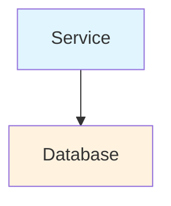
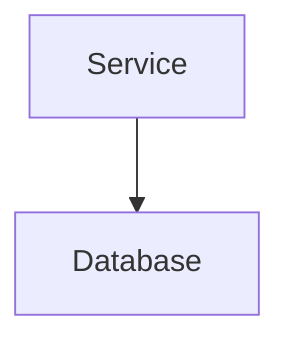
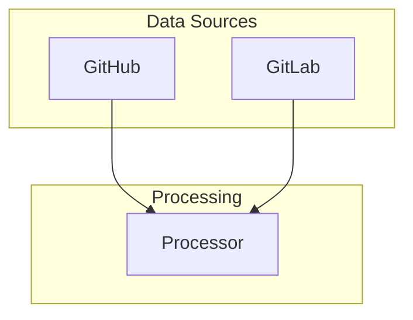
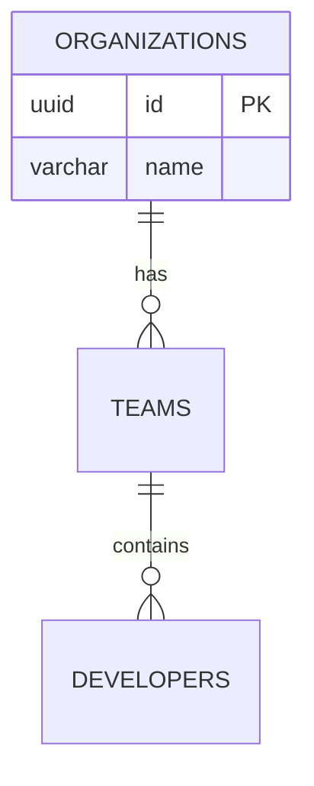
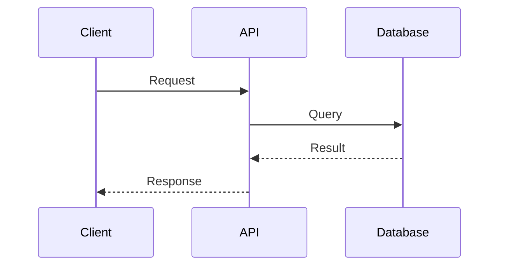

# MkDocs Material Theme - Professional Style Guide

Create a MkDocs documentation site with the following exact specifications:

## Design Requirements

### Overall Style
- **Minimal and professional** design
- **NO EMOJIS ANYWHERE** - absolutely no emoji characters in any documentation
- **Full viewport utilization** - no max-width constraints
- **Clean, tight spacing** - minimal padding and margins throughout
- **Light and dark mode support** with proper contrast

### Typography
- **Primary font**: Work Sans (300, 400, 500, 600, 700 weights)
- **Code font**: JetBrains Mono (400, 500, 700 weights)
- **Base font size**: 0.8316rem (optimized for readability)
- **Line height**: 1.5
- Font smoothing enabled for crisp rendering

### Layout Structure

#### Three-Pane Layout
1. **Left Sidebar (15rem width)**: Main navigation menu
2. **Center Content**: Main content area with max-width of 1000px
3. **Right Sidebar (12rem width)**: Table of contents for current page

#### Header
- **Full viewport width** spanning edge to edge
- Fixed position at top
- Height: 3.6rem
- Contains site title, search, and theme toggle

#### Footer
- **Hidden completely** - use bottom padding on content instead
- Content has 2rem bottom padding for breathing room

### Left Navigation Sidebar

#### Layout
- Fixed position on left
- Width: 15rem
- Starts immediately below header (top: 3.6rem)
- Inner padding: 0.5rem 0 (top and bottom spacing)
- Background must fill **full width** with no gaps on right side
- Height: calc(100vh - 3.6rem)
- z-index: 1 (below footer if present)
- overflow: hidden (for stability)

#### Colors
- **Light mode**:
  - Background: #fafafa
  - Border right: 1px solid #e0e0e0
- **Dark mode**:
  - Background: #1e1e1e
  - Border right: 1px solid #333

#### Section Headers (Top Level Items)
- Font size: 0.693rem
- Font weight: 600
- Padding: 0.55rem 1rem
- Text transform: UPPERCASE
- Letter spacing: 0.08em
- Background: #f5f5f5 (light) / #252525 (dark)
- Color: #666 (light) / #999 (dark)
- Border bottom: 1px solid between sections
- display: block, width: 100%
- Transition: background-color 0.2s ease, color 0.2s ease (not "all" for stability)

#### Nested Items (Sub-pages)
- Font size: 0.7392rem
- Font weight: 400
- Padding: 0.45rem 1rem 0.45rem 1.75rem (left indented)
- Border left: 3px solid transparent (shows accent color on hover/active)
- Background: white (light) / #1a1a1a (dark)
- Color: #555 (light) / #aaa (dark)
- Hover: #f8f8f8 background with #3498DB border
- Active: #e8f4fd background with #3498DB border and text color
- display: block, width: 100%
- Text overflow: ellipsis with overflow: hidden and white-space: nowrap
- Transition: background-color 0.2s ease, color 0.2s ease, border-left-color 0.2s ease

#### Scrollbar
- Always visible (overflow-y: scroll) to prevent layout shifts
- Width: 6px
- Thin style with custom colors
- Color: #ccc (light) / #444 (dark)

#### Navigation Elements
- **Navigation title/logo**: Hidden (display: none)
- **Expand/collapse icons**: Hidden (display: none) for cleaner appearance
- **Home link**: Hidden from sidebar navigation (only root path)
- **Duplicate links**: Hidden when both label and anchor exist (prevents double items)
- **All nav items**: margin: 0, padding: 0, display: block for consistent layout

### Right TOC Sidebar

#### Layout
- Fixed position on right
- Width: 12rem
- Starts immediately below header (top: 3.6rem, no padding-top)
- Height: calc(100vh - 3.6rem)
- overflow: hidden (for stability)

#### Spacing (Match Left Nav)
- Title padding: 0.55rem 1rem
- Link padding: 0.45rem 1rem
- Font size: 0.7392rem
- Font weight: 400
- Border left: 3px solid transparent
- Color: #555 (light) / #aaa (dark)

#### Title
- Font size: 0.693rem
- Font weight: 600
- Text transform: UPPERCASE
- Letter spacing: 0.08em
- Color: #666 (light) / #999 (dark)

#### Links
- Same styling as left nav nested items for consistency
- Border left shows #3498DB on hover and active states

### Content Area

#### Layout
- Margin left: 15rem (left sidebar width)
- Margin right: 12rem (right sidebar width)
- Padding: 0 on container, 0.5rem 1rem on inner
- Max-width: 1000px centered in available space
- Min-height: 100vh

#### Typography Spacing (Minimal)
- **H1**: 1.6632rem, margin-bottom 0.5rem, border-bottom 1px
- **H2**: 1.2936rem, margin-top 1rem, margin-bottom 0.4rem
- **H3**: 1.0626rem, margin-top 0.75rem, margin-bottom 0.3rem
- **H4**: 0.924rem, margin-top 0.5rem, margin-bottom 0.3rem
- **Paragraphs**: margin-bottom 0.5rem
- **Inline code**: font-size 0.79464em
- **Code blocks**: padding 0.5rem, margin 0.5rem 0
- **Lists**: margin 0.4rem 0, list items 0.15rem 0
- **Tables**: margin 0.5rem 0
- **Blockquotes**: margin 0.5rem 0, padding-left 0.75rem
- **Horizontal rules**: margin 1rem 0

#### Tables
- Font size: 0.7854rem
- Border: 1px solid rgba(0, 0, 0, 0.08)
- Header background: rgba(0, 0, 0, 0.04)
- Header padding: 0.6rem 0.75rem
- Cell padding: 0.5rem 0.75rem
- No border radius (sharp corners)

#### Admonitions
- Border left: 3px solid (colored by type)
- Padding: 0.4rem 0.6rem
- Margin: 0.5rem 0
- No border radius
- Title font-size: 0.7854rem
- Title margin-bottom: 0.3rem

### Global Settings

#### Scrollbar Behavior
- Force scrollbar always visible on html and body (overflow-y: scroll)
- Prevents layout shifts when content changes height
- Custom thin scrollbar styling throughout

#### Navigation Tabs
- **Hidden completely** - display: none !important
- Navigation is sidebar-only, not tabs at top

#### Color Scheme
- Primary: #2C3E50
- Accent: #3498DB
- Active/hover accent: #3498DB
- Dark mode accent: #5dade2

### MkDocs Configuration

#### Theme Settings
```yaml
theme:
  name: material
  font:
    text: Work Sans
    code: JetBrains Mono
  features:
    - navigation.instant
    - navigation.tracking
    - navigation.sections
    - navigation.expand
    - navigation.indexes
    - navigation.top
    - toc.follow
    - search.suggest
    - search.highlight
    - search.share
    - content.code.copy
    - content.code.annotate
  palette:
    - scheme: default
      primary: blue grey
      accent: blue
    - scheme: slate
      primary: blue grey
      accent: blue
```

#### Custom Files
- `docs/stylesheets/extra.css` - All custom CSS
- `docs/javascripts/mermaid-init.js` - Mermaid theme detection

#### Mermaid Diagrams (CRITICAL)

**DO NOT use custom style colors in Mermaid diagrams!** Light colors like `fill:#e1f5ff` are unreadable in dark mode.

**WRONG - Will break dark mode:**
```markdown

```

**CORRECT - Let Mermaid handle themes:**
```markdown

```

**Mermaid Configuration:**

1. Add to `mkdocs.yml`:
```yaml
extra_javascript:
  - https://cdn.jsdelivr.net/npm/mermaid@10/dist/mermaid.min.js
  - javascripts/mermaid-init.js
```

2. Create `docs/javascripts/mermaid-init.js`:
```javascript
// Simple Mermaid initialization - neutral theme works for both light and dark
mermaid.initialize({
  startOnLoad: true,
  theme: 'neutral'
});
```

3. Add minimal CSS in `extra.css`:
```css
.md-typeset .mermaid {
  margin: 1rem 0;
  text-align: center;
}

.md-typeset .mermaid svg {
  max-width: 100%;
  height: auto;
}
```

**Key Rules:**
- Never use `style` declarations with custom colors
- Use `theme: 'neutral'` - works well in both light and dark modes
- Keep JavaScript simple - no theme detection needed
- Test diagrams in both light and dark modes to verify readability
- Subgraph labels and standard node shapes work perfectly without custom styling
- All diagram types (graph, erDiagram, sequenceDiagram) work with neutral theme

**Diagram Types That Work Well:**

```markdown
## Flow diagrams with subgraphs (CORRECT)


## Entity-relationship diagrams (CORRECT)


## Sequence diagrams (CORRECT)

```

#### Important CSS Rules
```css
/* Remove navigation tabs */
.md-tabs { display: none !important; }

/* Force scrollbar always visible */
html, body { overflow-y: scroll; }

/* Header and footer full width */
.md-header { width: 100%; left: 0; right: 0; }
.md-footer { display: none; }

/* Left nav full width background and stability */
.md-sidebar--primary {
  top: 3.6rem;
  padding-top: 0;
  overflow: hidden;
  /* DO NOT use will-change: transform - causes layout instability */
}
.md-sidebar--primary .md-sidebar__scrollwrap { padding: 0; width: 100%; }
.md-sidebar--primary .md-sidebar__inner { width: 100%; padding: 0.5rem 0; }
.md-sidebar--primary .md-nav { width: 100%; padding: 0; margin: 0; }

/* Hide navigation elements for cleaner UI */
.md-sidebar--primary .md-nav__title { display: none; }
.md-sidebar--primary .md-nav__icon { display: none; }

/* Hide the Home link in navigation (only the exact root path) */
.md-sidebar--primary .md-nav--primary > .md-nav__list > .md-nav__item:has(> a.md-nav__link[href$="/open-source-sei-platform/"]) {
  display: none;
}

/* Prevent duplicate links (label + anchor) */
.md-sidebar--primary .md-nav__item > input.md-nav__toggle + label.md-nav__link + a.md-nav__link {
  display: none !important;
}

/* Navigation item stability */
.md-sidebar--primary .md-nav__item {
  padding: 0;
  margin: 0;
  display: block;
  width: 100%;
}

/* Text overflow handling */
.md-sidebar--primary .md-nav__link {
  overflow: hidden;
  text-overflow: ellipsis;
  white-space: nowrap;
  box-sizing: border-box;
}

/* Right sidebar stability */
.md-sidebar--secondary {
  top: 3.6rem;
  padding-top: 0;
  overflow: hidden;
}

/* Remove emoji */
img.emoji { display: none !important; }
```

### Responsive Behavior
- Below 76.1875em: Adjust content padding
- Below 60em: Hide right sidebar, adjust content padding further

### Key Principles
1. **Consistency**: Left and right sidebars have matching spacing
2. **Full width**: No gaps in sidebar backgrounds
3. **Minimal spacing**: Tight, professional spacing throughout
4. **No layout shifts**: Always-visible scrollbars prevent content jumping, no will-change property
5. **Clean design**: No emojis, no expand/collapse icons, no navigation logo
6. **Professional colors**: Muted, professional color palette
7. **Full viewport**: Header and footer span full width, sidebars fixed
8. **Stability**: Use specific CSS transitions (not "all"), overflow: hidden on sidebars
9. **No duplicates**: Hide duplicate navigation links when label and anchor both exist

### Markdown Formatting Best Practices

To ensure proper rendering in MkDocs Material, follow these formatting rules:

#### Nested Lists Under Numbered Items
Nested bullets under numbered lists MUST use **4-space indentation** (not 3 spaces):

**CORRECT:**
```markdown
1. **Item One**
    - Sub-item A
    - Sub-item B
    - Sub-item C

2. **Item Two**
    - Sub-item A
    - Sub-item B
```

**INCORRECT (will render as numbered items 1-7):**
```markdown
1. **Item One**
   - Sub-item A
   - Sub-item B
   - Sub-item C

2. **Item Two**
   - Sub-item A
   - Sub-item B
```

#### Blank Lines Before Lists
Always add a blank line before bullet lists, especially after text ending with a colon:

**CORRECT:**
```markdown
Edit the configuration file and set:

- `OPTION_ONE` - Description
- `OPTION_TWO` - Description
- `OPTION_THREE` - Description
```

**INCORRECT (will render as inline text):**
```markdown
Edit the configuration file and set:
- `OPTION_ONE` - Description
- `OPTION_TWO` - Description
- `OPTION_THREE` - Description
```

#### General List Formatting Rules
1. Always use blank lines to separate different list types
2. Maintain consistent indentation (4 spaces for nested content)
3. Add blank line before and after code blocks within lists
4. Use 4 spaces to continue paragraphs within list items

**Example of properly formatted complex list:**
```markdown
1. **Step One**

    Description paragraph for step one.

    ```bash
    command example
    ```

    - Nested bullet point
    - Another nested bullet

2. **Step Two**

    Description for step two.
```

### Testing Checklist

#### Design & Layout
- [ ] No emojis appear anywhere
- [ ] Left sidebar background fills full width (no gap on right)
- [ ] Right sidebar spacing matches left sidebar spacing
- [ ] Header spans full viewport width
- [ ] Footer is hidden with bottom padding on content
- [ ] Scrollbars always visible (no layout shifts when scrolling)
- [ ] Navigation tabs are hidden (sidebar navigation only)
- [ ] Sidebars start immediately below header with 0.5rem top padding
- [ ] Content has minimal, tight spacing
- [ ] Light and dark modes both look professional
- [ ] No expand/collapse icons visible in navigation
- [ ] Navigation title/logo is hidden
- [ ] Home link is hidden from sidebar navigation
- [ ] No duplicate navigation items (only one "Production Setup", etc.)
- [ ] Navigation doesn't move/shift when clicking items
- [ ] Long navigation items show ellipsis (...) when truncated

#### Markdown Formatting
- [ ] All nested bullets under numbered lists use 4-space indentation
- [ ] Blank line exists before all bullet lists (especially after colons)
- [ ] Numbered lists render correctly (not converting sub-bullets to numbers)
- [ ] Code blocks have proper spacing in lists
- [ ] Tables render correctly with no formatting issues

#### Mermaid Diagrams
- [ ] No custom `style` declarations with colors in any Mermaid diagrams
- [ ] All Mermaid diagrams readable in light mode
- [ ] All Mermaid diagrams readable in dark mode (check text contrast!)
- [ ] mermaid-init.js uses 'neutral' theme
- [ ] Diagrams render correctly without custom styling

## Implementation Steps

1. Install MkDocs Material: `pip install mkdocs-material pymdown-extensions`
2. Create `mkdocs.yml` with above configuration
3. Create `docs/stylesheets/extra.css` with custom CSS
4. Create `docs/javascripts/mermaid-init.js` for Mermaid theme detection
5. Add Mermaid CDN to `extra_javascript` in mkdocs.yml
6. Set up navigation structure in mkdocs.yml
7. Test with `mkdocs serve`
8. Verify all checklist items above (including Mermaid dark mode!)
9. Build with `mkdocs build`
10. Deploy with `mkdocs gh-deploy` (for GitHub Pages)