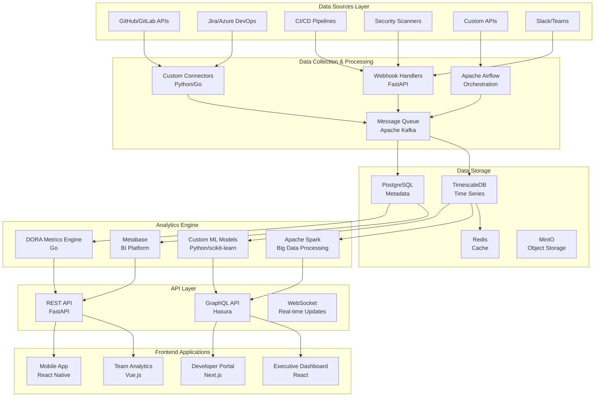

# Open Source Software Engineering Intelligence Platform
## Implementation Design & Architecture

[](https://opensource.org/licenses/MIT)
[](https://www.docker.com/)
[](https://kubernetes.io/)

## Overview

This repository contains the complete implementation design for building an enterprise-grade, open-source Software Engineering Intelligence (SEI) platform. The platform provides data-driven insights into engineering operations, team performance, and development lifecycle optimization.

## Architecture Overview



## Technology Stack

### Core Components

| Layer | Technology | Purpose | License |
|-------|------------|---------|---------|
| **Orchestration** | Apache Airflow | Workflow management & ETL | Apache 2.0 |
| **Database** | TimescaleDB | Time-series data storage | PostgreSQL License |
| **Analytics** | Metabase | Business Intelligence | AGPL-3.0 |
| **Processing** | Apache Spark | Big data processing | Apache 2.0 |
| **API** | FastAPI + Hasura | REST/GraphQL APIs | MIT |
| **Frontend** | React/Vue.js | Web applications | MIT |
| **Container** | Docker + Kubernetes | Orchestration | Apache 2.0 |

## Quick Start

```bash
# Clone the repository
git clone https://github.com/rcdelacruz/open-source-sei-platform.git
cd open-source-sei-platform

# Start with Docker Compose (Development)
docker-compose up -d

# Or deploy to Kubernetes (Production)
kubectl apply -f k8s/
```

## Project Structure

```
├── docs/                   # Documentation
├── src/
│   ├── collectors/         # Data collection services
│   ├── processors/         # Data processing pipelines
│   ├── apis/              # API services
│   ├── frontend/          # Web applications
│   └── ml/                # Machine learning models
├── infrastructure/
│   ├── docker/            # Docker configurations
│   ├── k8s/               # Kubernetes manifests
│   └── terraform/         # Infrastructure as Code
├── tests/                 # Test suites
└── scripts/               # Automation scripts
```

## Key Features

### 🎯 Core Analytics
- **DORA Metrics**: Deployment frequency, lead time, change failure rate, recovery time
- **Team Performance**: Velocity tracking, bottleneck identification, collaboration metrics
- **Code Quality**: Technical debt analysis, security vulnerability tracking
- **Predictive Analytics**: Risk prediction, capacity planning, timeline forecasting

### 🔌 Integrations
- **Version Control**: GitHub, GitLab, Bitbucket, Azure DevOps
- **Project Management**: Jira, Azure Boards, Linear, Asana
- **CI/CD**: Jenkins, GitHub Actions, GitLab CI, CircleCI, Tekton
- **Communication**: Slack, Microsoft Teams, Discord
- **Security**: Snyk, SonarQube, Veracode, Checkmarx

### 📊 Dashboards
- **Executive View**: High-level KPIs, ROI metrics, strategic insights
- **Engineering Manager**: Team performance, resource allocation, delivery tracking
- **Developer**: Personal productivity, code quality, review metrics
- **Product Manager**: Feature delivery, user impact, technical health

## Implementation Phases

### Phase 1: Foundation (Months 1-3)
- [ ] Infrastructure setup (Kubernetes, databases)
- [ ] Core data collectors (Git, Jira)
- [ ] Basic analytics pipeline
- [ ] Simple dashboards

### Phase 2: Core Features (Months 4-6)
- [ ] DORA metrics implementation
- [ ] Team performance analytics
- [ ] Advanced data connectors
- [ ] Real-time processing

### Phase 3: Advanced Analytics (Months 7-9)
- [ ] Machine learning models
- [ ] Predictive analytics
- [ ] Custom metrics framework
- [ ] Mobile applications

### Phase 4: Enterprise Features (Months 10-12)
- [ ] Multi-tenant architecture
- [ ] Advanced security features
- [ ] Performance optimization
- [ ] Documentation & training

## Cost Analysis

| Component | Open Source Cost | Commercial Alternative |
|-----------|------------------|----------------------|
| **Year 1** | $150K (dev + infra) | $300K+ (Logilica/LinearB) |
| **Year 2** | $100K (maintenance) | $600K+ (scaling costs) |
| **Year 3** | $120K (enhancements) | $900K+ (additional features) |
| **5-Year TCO** | $550K | $1.5M+ |

## Getting Started

1. **Prerequisites**
   - Docker & Docker Compose
   - Kubernetes cluster (optional)
   - PostgreSQL database
   - Redis instance

2. **Development Setup**
   ```bash
   # Install dependencies
   make install
   
   # Start development environment
   make dev
   
   # Run tests
   make test
   ```

3. **Production Deployment**
   ```bash
   # Deploy to Kubernetes
   make deploy-prod
   
   # Configure data sources
   make configure-sources
   ```

## Contributing

We welcome contributions! Please see our [Contributing Guide](docs/CONTRIBUTING.md) for details.

## License

This project is licensed under the MIT License - see the [LICENSE](LICENSE) file for details.

## Support

- 📚 [Documentation](docs/)
- 🐛 [Issues](https://github.com/rcdelacruz/open-source-sei-platform/issues)
- 💬 [Discussions](https://github.com/rcdelacruz/open-source-sei-platform/discussions)

## Roadmap

See our [Project Roadmap](docs/ROADMAP.md) for planned features and milestones.

---

**Built with ❤️ by the Open Source Community**