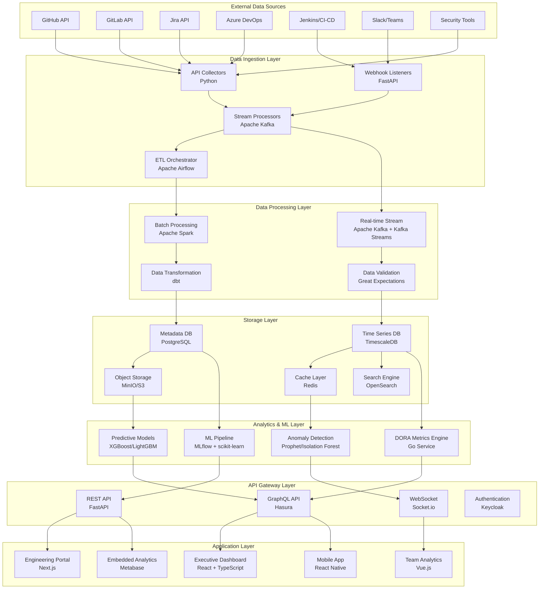
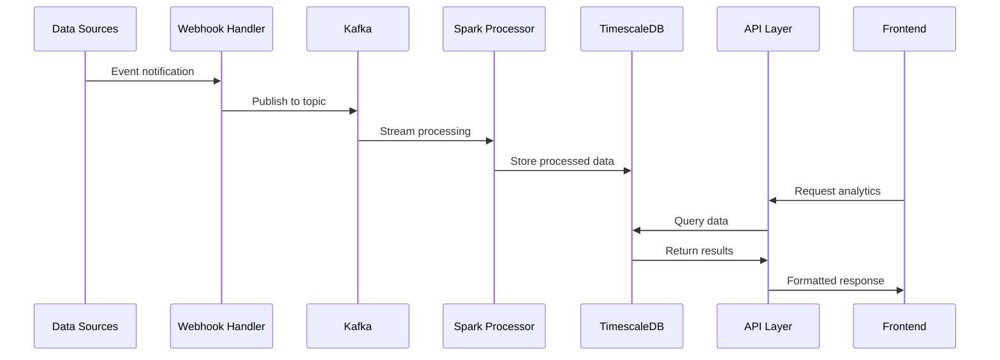
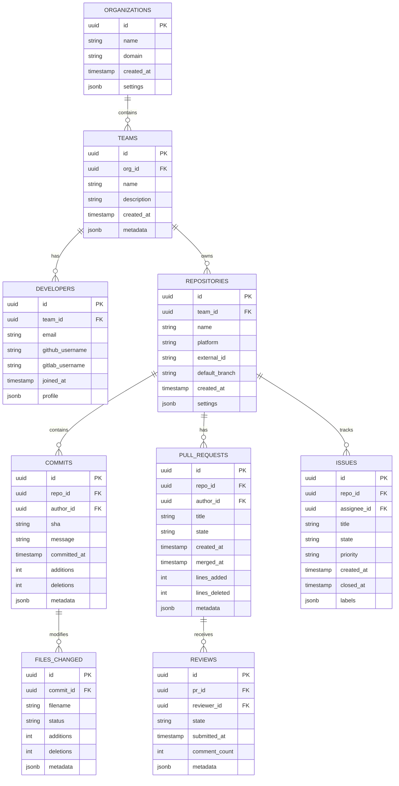
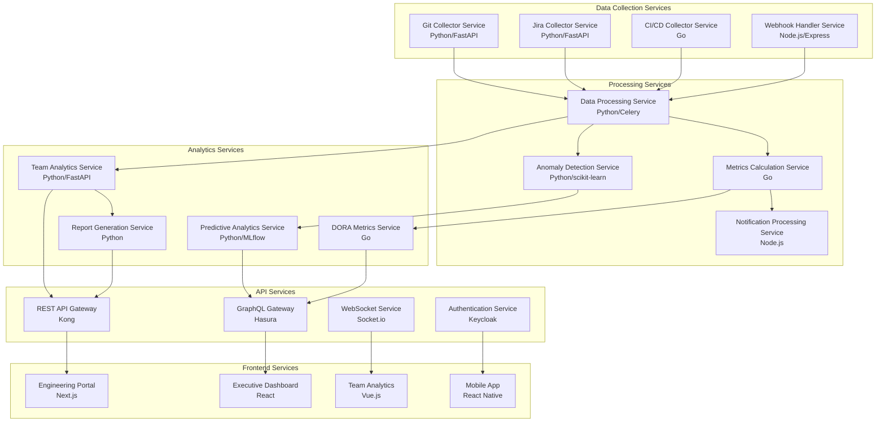
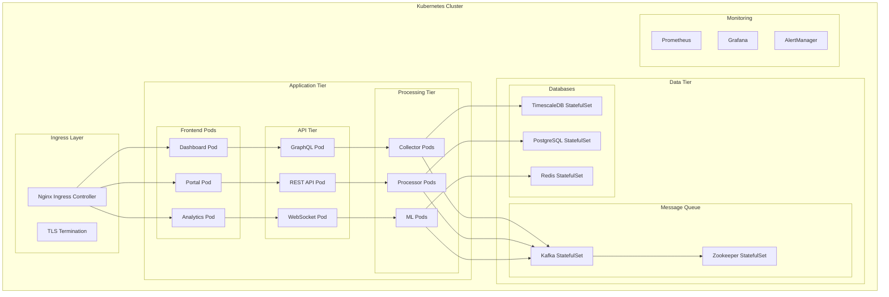
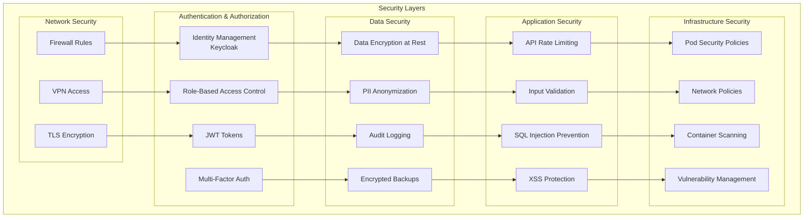
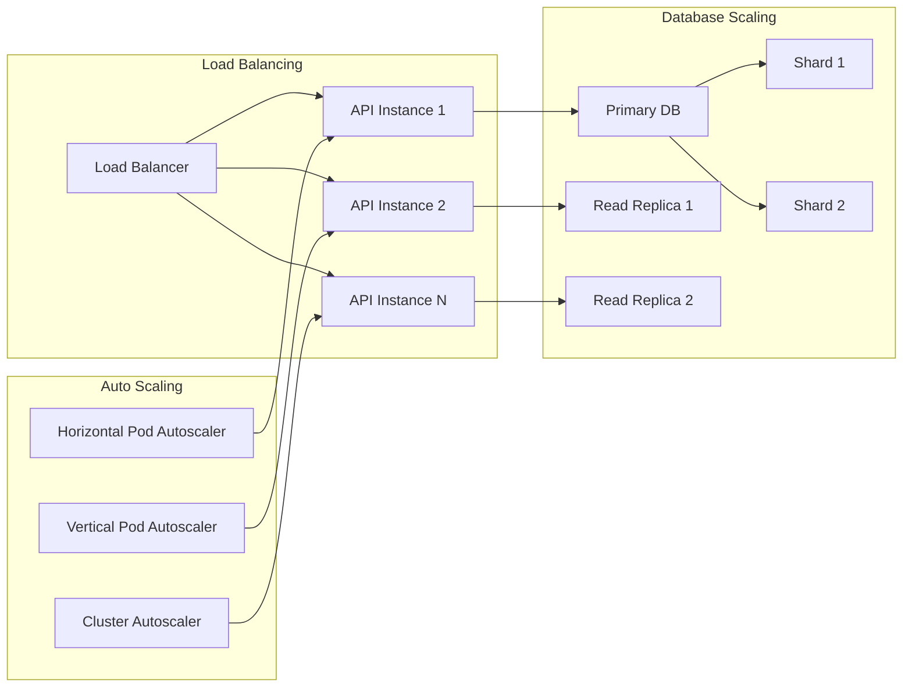
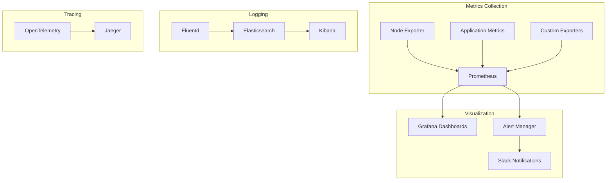

# Technical Architecture Documentation

## System Architecture

### High-Level Architecture



## Data Architecture

### Data Flow Pipeline



### Database Schema Design



## Microservices Architecture

### Service Breakdown



## Technology Stack Details

### Backend Technologies

| Service | Technology | Purpose | Justification |
|---------|------------|---------|---------------|
| **Data Collection** | Python/FastAPI | API integrations | Excellent libraries for API clients |
| **Real-time Processing** | Go | High-performance services | Superior concurrency and performance |
| **Batch Processing** | Apache Spark | Big data processing | Industry standard for large-scale data |
| **Orchestration** | Apache Airflow | Workflow management | Mature, Python-native orchestration |
| **Message Queue** | Apache Kafka | Event streaming | High-throughput, fault-tolerant messaging |
| **Database** | TimescaleDB | Time-series data | Optimized for time-series analytics |
| **Cache** | Redis | Fast data access | High-performance in-memory store |
| **Search** | OpenSearch | Full-text search | Open source, Elasticsearch-compatible |

### Frontend Technologies

| Component | Technology | Purpose | Justification |
|-----------|------------|---------|---------------|
| **Executive Dashboard** | React + TypeScript | Complex UI components | Mature ecosystem, strong typing |
| **Engineering Portal** | Next.js | SEO-optimized web app | Server-side rendering, great DX |
| **Team Analytics** | Vue.js 3 | Interactive dashboards | Excellent for data visualization |
| **Mobile App** | React Native | Cross-platform mobile | Code reuse, native performance |
| **Embedded Analytics** | Metabase | Self-service BI | Open source, user-friendly |

## Deployment Architecture

### Kubernetes Deployment



## Security Architecture

### Security Layers



## Performance & Scalability

### Horizontal Scaling Strategy



## Monitoring & Observability

### Monitoring Stack



## Data Models

### Core Data Entities

```mermaid
classDiagram
    class Organization {
        +UUID id
        +String name
        +String domain
        +DateTime createdAt
        +JSON settings
        +getTeams()
        +getMetrics()
    }
    
    class Team {
        +UUID id
        +UUID organizationId
        +String name
        +String description
        +DateTime createdAt
        +getDevelopers()
        +getRepositories()
        +getPerformanceMetrics()
    }
    
    class Developer {
        +UUID id
        +UUID teamId
        +String email
        +String githubUsername
        +DateTime joinedAt
        +getCommits()
        +getPullRequests()
        +getProductivityMetrics()
    }
    
    class Repository {
        +UUID id
        +UUID teamId
        +String name
        +String platform
        +String externalId
        +getCommits()
        +getPullRequests()
        +getIssues()
        +getHealthMetrics()
    }
    
    class Commit {
        +UUID id
        +UUID repositoryId
        +UUID authorId
        +String sha
        +String message
        +DateTime committedAt
        +Integer additions
        +Integer deletions
        +getFiles()
    }
    
    class PullRequest {
        +UUID id
        +UUID repositoryId
        +UUID authorId
        +String title
        +String state
        +DateTime createdAt
        +DateTime mergedAt
        +getReviews()
        +getComments()
        +getCycleTime()
    }
    
    Organization ||--o{ Team
    Team ||--o{ Developer
    Team ||--o{ Repository
    Repository ||--o{ Commit
    Repository ||--o{ PullRequest
    Developer ||--o{ Commit
    Developer ||--o{ PullRequest
```

## API Design

### GraphQL Schema

```graphql
type Organization {
  id: ID!
  name: String!
  domain: String!
  teams: [Team!]!
  metrics: OrganizationMetrics!
}

type Team {
  id: ID!
  name: String!
  organization: Organization!
  developers: [Developer!]!
  repositories: [Repository!]!
  metrics: TeamMetrics!
}

type Developer {
  id: ID!
  email: String!
  githubUsername: String
  team: Team!
  commits: [Commit!]!
  pullRequests: [PullRequest!]!
  productivity: ProductivityMetrics!
}

type Repository {
  id: ID!
  name: String!
  platform: String!
  team: Team!
  commits: [Commit!]!
  pullRequests: [PullRequest!]!
  health: RepositoryHealth!
}

type DORAMetrics {
  deploymentFrequency: Float!
  leadTimeForChanges: Float!
  changeFailureRate: Float!
  timeToRestoreService: Float!
  period: DateRange!
}

type Query {
  organization(id: ID!): Organization
  team(id: ID!): Team
  developer(id: ID!): Developer
  repository(id: ID!): Repository
  doraMetrics(teamId: ID!, period: DateRange!): DORAMetrics
}
```

### REST API Endpoints

```yaml
# Core Resources
GET    /api/v1/organizations
POST   /api/v1/organizations
GET    /api/v1/organizations/{id}
PUT    /api/v1/organizations/{id}
DELETE /api/v1/organizations/{id}

GET    /api/v1/teams
POST   /api/v1/teams
GET    /api/v1/teams/{id}
PUT    /api/v1/teams/{id}
DELETE /api/v1/teams/{id}

# Analytics Endpoints
GET    /api/v1/analytics/dora/{teamId}
GET    /api/v1/analytics/productivity/{teamId}
GET    /api/v1/analytics/velocity/{teamId}
GET    /api/v1/analytics/quality/{repositoryId}

# Real-time Endpoints
GET    /api/v1/events/stream
POST   /api/v1/webhooks/github
POST   /api/v1/webhooks/gitlab
POST   /api/v1/webhooks/jira
```

## Configuration Management

### Environment Configuration

```yaml
# config/production.yaml
database:
  timescale:
    host: timescaledb-primary
    port: 5432
    database: sei_platform
    ssl_mode: require
  
  postgresql:
    host: postgresql-primary
    port: 5432
    database: sei_metadata
    
redis:
  host: redis-cluster
  port: 6379
  cluster_mode: true

kafka:
  brokers:
    - kafka-broker-1:9092
    - kafka-broker-2:9092
    - kafka-broker-3:9092
  
monitoring:
  prometheus:
    endpoint: http://prometheus:9090
  grafana:
    endpoint: http://grafana:3000
    
security:
  encryption:
    algorithm: AES-256-GCM
    key_rotation_days: 90
  
  authentication:
    provider: keycloak
    realm: sei-platform
    client_id: sei-platform-api
```

This technical architecture provides a comprehensive foundation for building the open source SEI platform with enterprise-grade scalability, security, and maintainability.