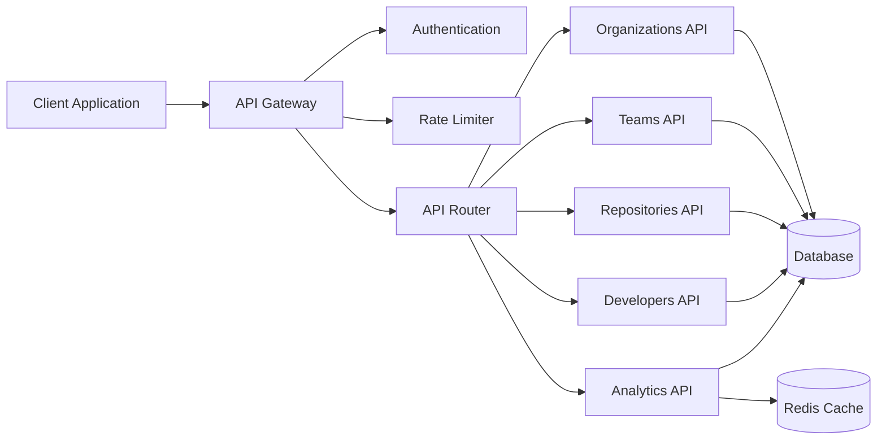
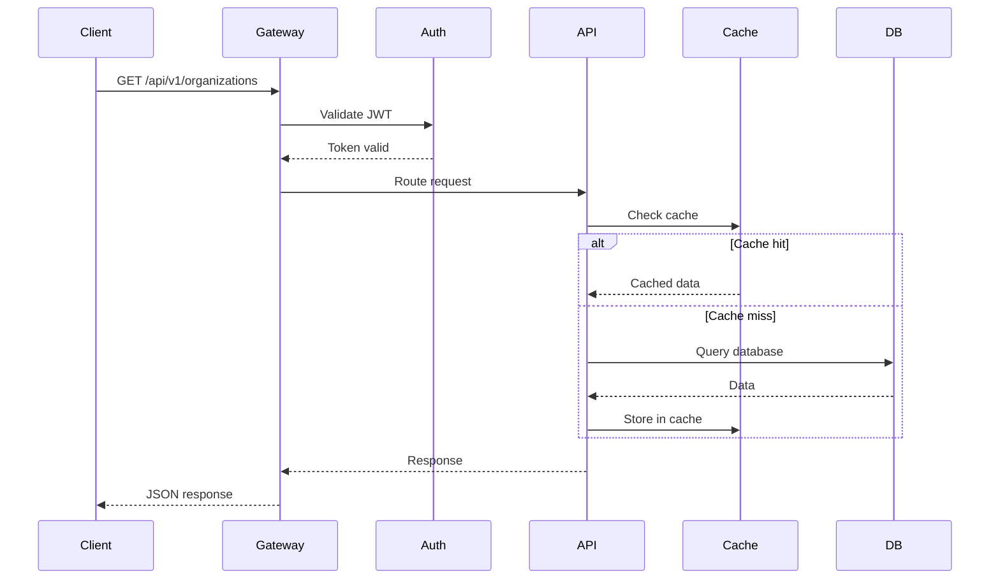

# API Design

## API Architecture



## REST API Principles

### Base URL

```
https://api.sei-platform.com/api/v1
```

### Versioning

- API versioned through URL path: `/api/v1`, `/api/v2`
- Breaking changes require new version
- Maintain backward compatibility for at least 6 months

### Authentication

All requests require Bearer token:

```http
Authorization: Bearer <jwt_token>
```

### Response Format

Standard JSON response structure:

```json
{
  "data": {},
  "meta": {
    "timestamp": "2024-01-15T10:30:00Z",
    "request_id": "req_abc123"
  }
}
```

Error response:

```json
{
  "error": {
    "code": "RESOURCE_NOT_FOUND",
    "message": "Organization not found",
    "details": {}
  },
  "meta": {
    "timestamp": "2024-01-15T10:30:00Z",
    "request_id": "req_abc123"
  }
}
```

## API Endpoints

### Organizations

#### List Organizations

```http
GET /api/v1/organizations
```

**Query Parameters**:

- `skip` (integer): Offset for pagination (default: 0)
- `limit` (integer): Number of results (default: 100, max: 1000)
- `sort` (string): Sort field (default: created_at)
- `order` (string): Sort order: asc, desc (default: desc)

**Response**:

```json
{
  "data": [
    {
      "id": "550e8400-e29b-41d4-a716-446655440000",
      "name": "Acme Corporation",
      "slug": "acme-corp",
      "created_at": "2024-01-01T00:00:00Z",
      "updated_at": "2024-01-01T00:00:00Z"
    }
  ],
  "meta": {
    "total": 1,
    "skip": 0,
    "limit": 100
  }
}
```

#### Create Organization

```http
POST /api/v1/organizations
```

**Request Body**:

```json
{
  "name": "Acme Corporation",
  "slug": "acme-corp"
}
```

#### Get Organization

```http
GET /api/v1/organizations/{org_id}
```

#### Update Organization

```http
PUT /api/v1/organizations/{org_id}
```

#### Delete Organization

```http
DELETE /api/v1/organizations/{org_id}
```

### Teams

#### List Teams

```http
GET /api/v1/organizations/{org_id}/teams
```

#### Create Team

```http
POST /api/v1/organizations/{org_id}/teams
```

**Request Body**:

```json
{
  "name": "Platform Team",
  "slug": "platform"
}
```

#### Get Team

```http
GET /api/v1/teams/{team_id}
```

#### Update Team

```http
PUT /api/v1/teams/{team_id}
```

#### Delete Team

```http
DELETE /api/v1/teams/{team_id}
```

#### Team Members

```http
GET /api/v1/teams/{team_id}/members
POST /api/v1/teams/{team_id}/members
DELETE /api/v1/teams/{team_id}/members/{developer_id}
```

### Repositories

#### List Repositories

```http
GET /api/v1/organizations/{org_id}/repositories
```

#### Create Repository

```http
POST /api/v1/organizations/{org_id}/repositories
```

**Request Body**:

```json
{
  "name": "api-service",
  "provider": "github",
  "provider_id": "12345678",
  "url": "https://github.com/acme-corp/api-service",
  "default_branch": "main"
}
```

### Developers

#### List Developers

```http
GET /api/v1/developers
```

#### Create Developer

```http
POST /api/v1/developers
```

**Request Body**:

```json
{
  "email": "developer@acme.com",
  "name": "Jane Developer",
  "github_username": "janedev"
}
```

### Analytics

#### Get DORA Metrics

```http
GET /api/v1/analytics/dora
```

**Query Parameters**:

- `repository_id` (uuid): Repository ID
- `team_id` (uuid): Team ID
- `start_date` (date): Start date (ISO 8601)
- `end_date` (date): End date (ISO 8601)
- `period` (string): daily, weekly, monthly

**Response**:

```json
{
  "data": {
    "deployment_frequency": {
      "value": 2.5,
      "unit": "per_day",
      "trend": "increasing"
    },
    "lead_time_for_changes": {
      "value": 24.5,
      "unit": "hours",
      "trend": "decreasing"
    },
    "change_failure_rate": {
      "value": 0.15,
      "unit": "percentage",
      "trend": "stable"
    },
    "time_to_restore": {
      "value": 2.3,
      "unit": "hours",
      "trend": "decreasing"
    }
  }
}
```

#### Get Team Metrics

```http
GET /api/v1/analytics/teams/{team_id}
```

#### Get Developer Metrics

```http
GET /api/v1/analytics/developers/{developer_id}
```

## Request/Response Flow



## Error Codes

| Code | HTTP Status | Description |
|------|-------------|-------------|
| UNAUTHORIZED | 401 | Invalid or missing authentication |
| FORBIDDEN | 403 | Insufficient permissions |
| NOT_FOUND | 404 | Resource not found |
| VALIDATION_ERROR | 422 | Invalid request data |
| RATE_LIMIT_EXCEEDED | 429 | Too many requests |
| INTERNAL_ERROR | 500 | Server error |

## Rate Limiting

**Default Limits**:

- 1000 requests per hour per IP
- 100 requests per minute (burst)

**Headers**:

```http
X-RateLimit-Limit: 1000
X-RateLimit-Remaining: 999
X-RateLimit-Reset: 1705392000
```

## Pagination

**Request**:

```http
GET /api/v1/organizations?skip=0&limit=50
```

**Response**:

```json
{
  "data": [...],
  "meta": {
    "total": 150,
    "skip": 0,
    "limit": 50,
    "has_more": true
  }
}
```

## Filtering

**Query String Filters**:

```http
GET /api/v1/repositories?provider=github&status=active
```

## Sorting

**Syntax**:

```http
GET /api/v1/organizations?sort=name&order=asc
```

## Field Selection

**Sparse Fieldsets**:

```http
GET /api/v1/organizations?fields=id,name,slug
```

## Webhooks

**Webhook Events**:

- `organization.created`
- `team.created`
- `repository.created`
- `deployment.completed`

**Webhook Payload**:

```json
{
  "event": "deployment.completed",
  "timestamp": "2024-01-15T10:30:00Z",
  "data": {
    "repository_id": "uuid",
    "environment": "production",
    "status": "success"
  }
}
```

## API Clients

### Python Example

```python
import requests

BASE_URL = "https://api.sei-platform.com/api/v1"
TOKEN = "your_jwt_token"

headers = {
    "Authorization": f"Bearer {TOKEN}",
    "Content-Type": "application/json"
}

# Get organizations
response = requests.get(f"{BASE_URL}/organizations", headers=headers)
organizations = response.json()["data"]

# Create team
team_data = {
    "name": "Platform Team",
    "slug": "platform"
}
response = requests.post(
    f"{BASE_URL}/organizations/{org_id}/teams",
    headers=headers,
    json=team_data
)
```

### JavaScript Example

```javascript
const BASE_URL = 'https://api.sei-platform.com/api/v1';
const TOKEN = 'your_jwt_token';

const headers = {
  'Authorization': `Bearer ${TOKEN}`,
  'Content-Type': 'application/json'
};

// Get organizations
const response = await fetch(`${BASE_URL}/organizations`, { headers });
const { data } = await response.json();

// Create team
const teamData = {
  name: 'Platform Team',
  slug: 'platform'
};
await fetch(`${BASE_URL}/organizations/${orgId}/teams`, {
  method: 'POST',
  headers,
  body: JSON.stringify(teamData)
});
```

## Next Steps

- [API Authentication](../api/authentication.md) - Authentication details
- [API Reference](../api/introduction.md) - Complete API documentation
- [Security](security.md) - API security implementation