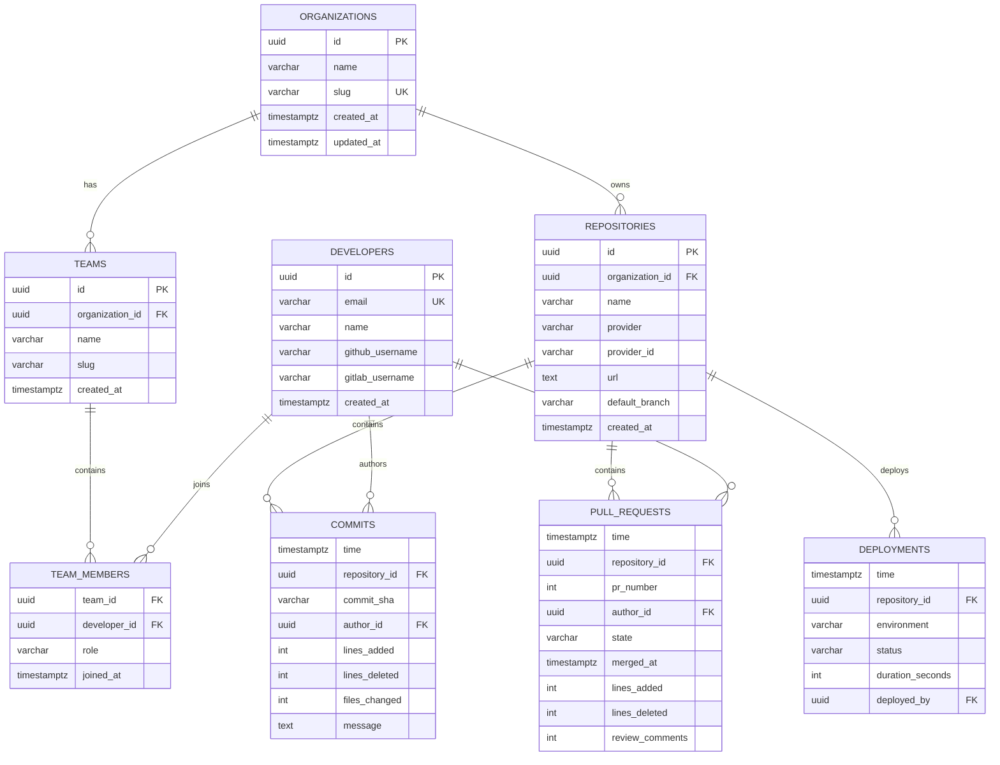
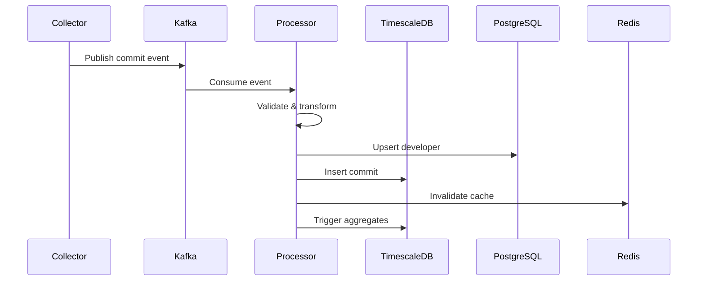

# Data Models

## Entity Relationship Diagram



## Core Entity Models

### Organization

Represents a company or organization using the platform.

**Fields**:

- `id` (UUID): Primary key
- `name` (String): Organization name
- `slug` (String): URL-friendly identifier (unique)
- `created_at` (Timestamp): Creation timestamp
- `updated_at` (Timestamp): Last update timestamp

**Relationships**:

- Has many Teams
- Has many Repositories

**Example**:

```json
{
  "id": "550e8400-e29b-41d4-a716-446655440000",
  "name": "Acme Corporation",
  "slug": "acme-corp",
  "created_at": "2024-01-01T00:00:00Z",
  "updated_at": "2024-01-01T00:00:00Z"
}
```

### Team

Represents a development team within an organization.

**Fields**:

- `id` (UUID): Primary key
- `organization_id` (UUID): Foreign key to organization
- `name` (String): Team name
- `slug` (String): URL-friendly identifier (unique within org)
- `created_at` (Timestamp): Creation timestamp

**Relationships**:

- Belongs to Organization
- Has many Developers (through team_members)

**Example**:

```json
{
  "id": "660e8400-e29b-41d4-a716-446655440001",
  "organization_id": "550e8400-e29b-41d4-a716-446655440000",
  "name": "Platform Team",
  "slug": "platform",
  "created_at": "2024-01-01T00:00:00Z"
}
```

### Developer

Represents an individual developer across the platform.

**Fields**:

- `id` (UUID): Primary key
- `email` (String): Email address (unique)
- `name` (String): Full name
- `github_username` (String): GitHub username
- `gitlab_username` (String): GitLab username
- `created_at` (Timestamp): Creation timestamp

**Relationships**:

- Belongs to many Teams (through team_members)
- Has many Commits
- Has many Pull Requests

**Example**:

```json
{
  "id": "770e8400-e29b-41d4-a716-446655440002",
  "email": "developer@acme.com",
  "name": "Jane Developer",
  "github_username": "janedev",
  "gitlab_username": "janedev",
  "created_at": "2024-01-01T00:00:00Z"
}
```

### Repository

Represents a Git repository tracked by the platform.

**Fields**:

- `id` (UUID): Primary key
- `organization_id` (UUID): Foreign key to organization
- `name` (String): Repository name
- `provider` (String): Git provider (github, gitlab, bitbucket)
- `provider_id` (String): Provider-specific ID
- `url` (String): Repository URL
- `default_branch` (String): Default branch name
- `created_at` (Timestamp): Creation timestamp

**Relationships**:

- Belongs to Organization
- Has many Commits
- Has many Pull Requests
- Has many Deployments

**Example**:

```json
{
  "id": "880e8400-e29b-41d4-a716-446655440003",
  "organization_id": "550e8400-e29b-41d4-a716-446655440000",
  "name": "api-service",
  "provider": "github",
  "provider_id": "12345678",
  "url": "https://github.com/acme-corp/api-service",
  "default_branch": "main",
  "created_at": "2024-01-01T00:00:00Z"
}
```

## Time-Series Models

### Commit

Represents a Git commit event (stored in TimescaleDB).

**Fields**:

- `time` (Timestamp): Commit timestamp (partition key)
- `repository_id` (UUID): Repository reference
- `commit_sha` (String): Git commit SHA
- `author_id` (UUID): Developer reference
- `lines_added` (Integer): Lines of code added
- `lines_deleted` (Integer): Lines of code deleted
- `files_changed` (Integer): Number of files modified
- `message` (Text): Commit message

**Indexes**:

- Hypertable partitioned by time
- Index on repository_id
- Index on author_id

### Pull Request

Represents a pull request event.

**Fields**:

- `time` (Timestamp): PR creation time (partition key)
- `repository_id` (UUID): Repository reference
- `pr_number` (Integer): PR number
- `author_id` (UUID): Developer reference
- `state` (String): open, closed, merged
- `merged_at` (Timestamp): Merge timestamp
- `lines_added` (Integer): Lines added
- `lines_deleted` (Integer): Lines deleted
- `review_comments` (Integer): Number of review comments

### Deployment

Represents a deployment event.

**Fields**:

- `time` (Timestamp): Deployment time (partition key)
- `repository_id` (UUID): Repository reference
- `environment` (String): production, staging, development
- `status` (String): success, failed, in_progress
- `duration_seconds` (Integer): Deployment duration
- `deployed_by` (UUID): Developer reference

## Aggregate Models

### DailyCommitStats

Continuous aggregate for daily commit statistics.

**Fields**:

- `day` (Date): Day bucket
- `repository_id` (UUID): Repository reference
- `commit_count` (Integer): Total commits
- `total_lines_added` (Integer): Sum of lines added
- `total_lines_deleted` (Integer): Sum of lines deleted

**Refresh Policy**: Every hour

### WeeklyDORAMetrics

Continuous aggregate for weekly DORA metrics.

**Fields**:

- `week` (Date): Week bucket
- `repository_id` (UUID): Repository reference
- `deployment_count` (Integer): Number of deployments
- `avg_duration` (Float): Average deployment duration
- `failed_count` (Integer): Number of failed deployments

**Calculated Metrics**:

- Deployment Frequency = deployment_count / 7
- Change Failure Rate = failed_count / deployment_count

## Data Flow



## Schema Evolution

### Migration Strategy

1. **Backward Compatible Changes**: Add new columns with defaults
2. **Breaking Changes**: Versioned schemas with migration period
3. **Data Transformations**: Background jobs for large datasets

### Example Migration

```python
# Alembic migration
def upgrade():
    op.add_column('developers',
        sa.Column('bitbucket_username', sa.String(255), nullable=True)
    )
    op.create_index('ix_developers_bitbucket', 'developers', ['bitbucket_username'])

def downgrade():
    op.drop_index('ix_developers_bitbucket')
    op.drop_column('developers', 'bitbucket_username')
```

## Data Retention Policies

### Time-Series Data

- **Raw Events**: 90 days
- **Daily Aggregates**: 2 years
- **Weekly Aggregates**: 5 years
- **Monthly Aggregates**: Indefinite

### Relational Data

- **Active Records**: Indefinite
- **Soft Deleted**: 1 year
- **Audit Logs**: 3 years

## Query Patterns

### Common Queries

**Get team metrics**:

```sql
SELECT
    d.day,
    SUM(d.commit_count) as total_commits,
    SUM(d.total_lines_added) as total_additions
FROM daily_commit_stats d
JOIN repositories r ON d.repository_id = r.id
JOIN teams t ON r.organization_id = t.organization_id
WHERE t.id = $team_id
  AND d.day >= NOW() - INTERVAL '30 days'
GROUP BY d.day
ORDER BY d.day;
```

**Calculate deployment frequency**:

```sql
SELECT
    w.week,
    w.deployment_count::float / 7 as deployments_per_day
FROM weekly_dora_metrics w
WHERE w.repository_id = $repo_id
  AND w.week >= NOW() - INTERVAL '12 weeks'
ORDER BY w.week;
```

## Next Steps

- [Database Schema](database-schema.md) - Complete schema DDL
- [API Design](api-design.md) - API endpoints for data access
- [Security](security.md) - Data security and access control