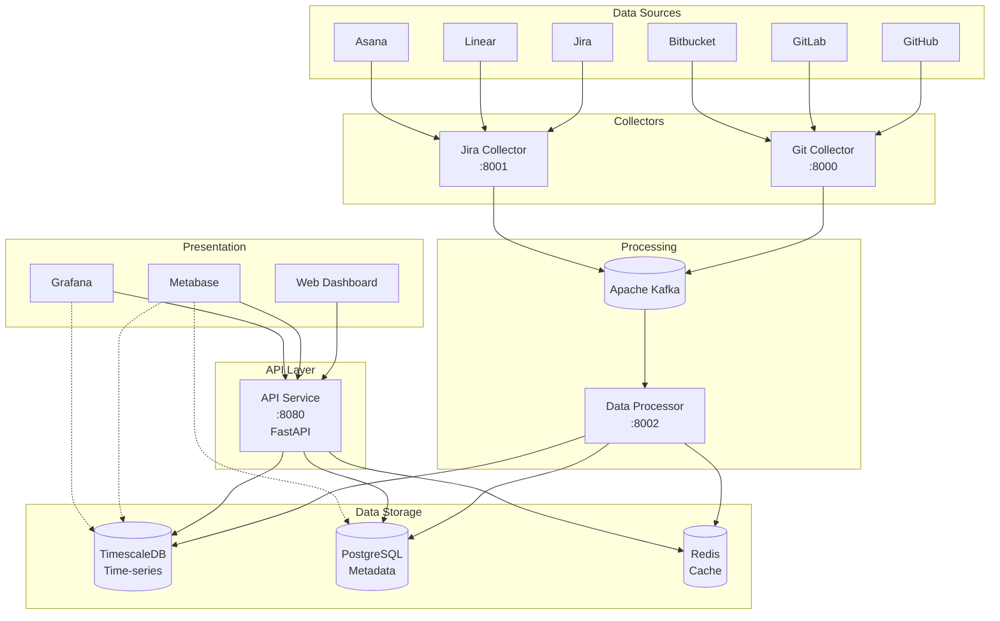

# Architecture Overview

## Introduction

The SEI Platform is built using a **microservices architecture** designed for scalability, maintainability, and extensibility. The platform collects, processes, and analyzes software engineering data from multiple sources to provide actionable insights through DORA metrics and team analytics.

## High-Level Architecture

## Core Components

### 1. Data Collectors

**Purpose**: Integrate with external data sources and collect software engineering metrics

- **Git Collector**: Collects commits, pull requests, code reviews from GitHub, GitLab, Bitbucket
- **Jira Collector**: Collects issues, sprints, story points from project management tools
- Designed as independent microservices for parallel data collection
- Support multiple authentication methods (OAuth, API tokens, SSH keys)

### 2. Data Processing Layer

**Purpose**: Transform raw data into actionable metrics

- **Data Processor**: Consumes events from Kafka, calculates metrics, stores in database
- Real-time event processing using Apache Kafka
- Batch processing for historical data analysis
- Metric calculation engines for DORA metrics

### 3. API Layer

**Purpose**: Provide REST API for frontend and external integrations

- **API Service**: FastAPI-based REST API
- Authentication and authorization
- Rate limiting and request validation
- OpenAPI/Swagger documentation
- Versioned endpoints (/api/v1)

### 4. Data Storage

**Purpose**: Persist and query software engineering data

- **TimescaleDB**: Time-series data for metrics, events, and analytics
- **PostgreSQL**: Relational data for organizations, teams, repositories
- **Redis**: Caching layer for frequently accessed data
- **Kafka**: Event streaming and message queue

### 5. Analytics & Visualization

**Purpose**: Present insights through dashboards and reports

- **Metabase**: Self-service BI tool for custom queries and reports
- **Grafana**: Real-time dashboards with Prometheus integration
- **Web Dashboard**: React-based frontend (planned)

### 6. Infrastructure Services

**Purpose**: Support platform operations and monitoring

- **Prometheus**: Metrics collection and alerting
- **Grafana**: Monitoring dashboards
- **Apache Airflow**: Workflow orchestration for batch jobs
- **PgAdmin**: Database administration
- **Kafka UI**: Message queue monitoring

## Design Principles

### 1. Microservices Architecture

Each service is independently deployable and scalable:

- **Isolation**: Services can be developed, deployed, and scaled independently
- **Technology Diversity**: Each service can use the most appropriate technology
- **Fault Tolerance**: Failure in one service doesn't cascade to others
- **Team Autonomy**: Different teams can own different services

### 2. Event-Driven Architecture

Asynchronous communication through Apache Kafka:

- **Decoupling**: Services don't need to know about each other
- **Scalability**: Easily handle spikes in data collection
- **Reliability**: Message persistence and replay capabilities
- **Real-time Processing**: Stream processing for immediate insights

### 3. API-First Design

Well-defined APIs enable integration and extensibility:

- **OpenAPI Specification**: Auto-generated documentation
- **Versioning**: Backward compatibility with API versions
- **Standard Protocols**: REST, JSON, HTTP/2
- **Rate Limiting**: Protect against abuse

### 4. Data-Driven Decisions

Store rich data to enable flexible analysis:

- **Time-Series Data**: Track metrics over time with TimescaleDB
- **Event Sourcing**: Store all events for audit and replay
- **Schema Evolution**: Support schema changes without downtime
- **Data Retention**: Configurable retention policies

### 5. Security First

Built-in security at every layer:

- **Authentication**: JWT tokens, API keys, OAuth 2.0
- **Authorization**: Role-based access control (RBAC)
- **Encryption**: TLS in transit, encryption at rest
- **Audit Logging**: Track all access and changes

### 6. Observability

Comprehensive monitoring and debugging:

- **Metrics**: Prometheus metrics for all services
- **Logs**: Structured logging with correlation IDs
- **Tracing**: Distributed tracing (planned)
- **Alerting**: Proactive monitoring and alerts

## Technology Stack

### Backend Services

- **Python 3.11+**: Primary language for services
- **FastAPI**: Modern, fast API framework
- **SQLAlchemy**: ORM for database access
- **Pydantic**: Data validation and settings management
- **Alembic**: Database migration tool

### Data Storage

- **TimescaleDB**: PostgreSQL extension for time-series data
- **PostgreSQL 15+**: Relational database
- **Redis 7+**: In-memory cache and session store
- **Apache Kafka**: Distributed event streaming

### Infrastructure

- **Docker**: Containerization
- **Docker Compose**: Local development orchestration
- **Kubernetes**: Production orchestration (planned)
- **Nginx**: Reverse proxy and load balancer (planned)

### Monitoring & Analytics

- **Prometheus**: Metrics collection
- **Grafana**: Visualization
- **Metabase**: Business intelligence
- **Apache Airflow**: Workflow orchestration

### Development Tools

- **pytest**: Testing framework
- **Black**: Code formatter
- **Flake8**: Linting
- **mypy**: Type checking
- **pre-commit**: Git hooks

## Deployment Architecture

### Development Environment

- Docker Compose orchestrates all services
- Shared networks for inter-service communication
- Volume mounts for hot-reloading during development
- Local ports exposed for debugging

### Production Environment (Planned)

- Kubernetes cluster with multiple nodes
- Auto-scaling based on load
- Load balancing across service instances
- Blue-green deployments for zero downtime
- Managed databases (AWS RDS, TimescaleDB Cloud)
- CDN for static assets

## Data Flow

### Collection Flow

1. **Collectors** poll external APIs on schedule (hourly/daily)
2. Raw data published to Kafka topics (`git.commits`, `jira.issues`)
3. **Data Processor** consumes events from Kafka
4. Processor transforms data and calculates metrics
5. Metrics stored in TimescaleDB, metadata in PostgreSQL

### Query Flow

1. **Client** requests data from API Service
2. API authenticates request and validates permissions
3. API checks Redis cache for cached results
4. On cache miss, API queries TimescaleDB/PostgreSQL
5. Results cached in Redis with TTL
6. Response returned to client with proper formatting

### Analytics Flow

1. **Metabase/Grafana** queries API or directly connects to databases
2. Pre-computed metrics retrieved for dashboards
3. Ad-hoc queries run for custom analysis
4. Results visualized in charts and reports

## Scalability Considerations

### Horizontal Scaling

- Add more collector instances to handle more repositories
- Scale data processor instances to handle higher event volume
- Scale API service instances behind load balancer

### Vertical Scaling

- Increase database resources for larger datasets
- Increase Redis memory for more caching
- Increase Kafka brokers for higher throughput

### Performance Optimization

- Connection pooling for databases
- Query optimization with proper indexes
- Caching frequently accessed data
- Pagination for large result sets
- Compression for data transfer

## Security Architecture

### Authentication & Authorization

- JWT tokens for API authentication
- API keys for service-to-service communication
- OAuth 2.0 for third-party integrations
- Role-based access control (RBAC)

### Network Security

- Services communicate within private networks
- Only API gateway exposed publicly
- TLS encryption for all connections
- Firewall rules limit access

### Data Security

- Secrets stored in environment variables
- Database encryption at rest
- Sensitive data redacted in logs
- Regular security audits

## Next Steps

- [System Design](system-design.md) - Detailed component design
- [Data Models](data-models.md) - Database schemas and relationships
- [API Design](api-design.md) - API specifications
- [Database Schema](database-schema.md) - Schema definitions
- [Security](security.md) - Security implementation details