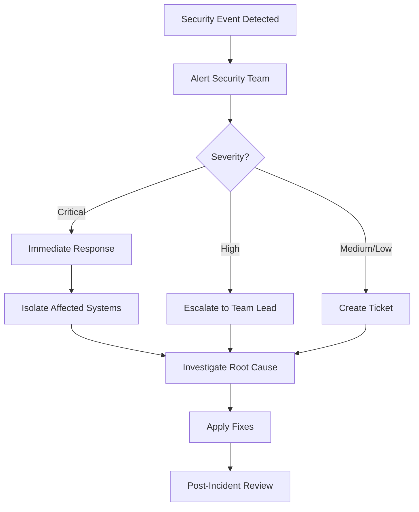

# Security

## Security Overview

The SEI Platform implements security at multiple layers to protect data and ensure authorized access.

## Authentication

### JWT Token Authentication

**Token Structure**:

```json
{
  "sub": "user_id",
  "email": "user@example.com",
  "org_id": "organization_id",
  "role": "admin",
  "exp": 1234567890,
  "iat": 1234567800
}
```

**Token Generation**:

```python
import jwt
from datetime import datetime, timedelta

def generate_token(user_id: str, email: str, org_id: str, role: str) -> str:
    payload = {
        "sub": user_id,
        "email": email,
        "org_id": org_id,
        "role": role,
        "exp": datetime.utcnow() + timedelta(hours=24),
        "iat": datetime.utcnow()
    }
    return jwt.encode(payload, SECRET_KEY, algorithm="HS256")
```

**Token Validation**:

```python
from fastapi import HTTPException, Security
from fastapi.security import HTTPBearer, HTTPAuthorizationCredentials

security = HTTPBearer()

async def verify_token(credentials: HTTPAuthorizationCredentials = Security(security)):
    try:
        payload = jwt.decode(
            credentials.credentials,
            SECRET_KEY,
            algorithms=["HS256"]
        )
        return payload
    except jwt.ExpiredSignatureError:
        raise HTTPException(status_code=401, detail="Token expired")
    except jwt.InvalidTokenError:
        raise HTTPException(status_code=401, detail="Invalid token")
```

### API Key Authentication

**API Key Format**: `sei_live_<random_32_chars>`

**Storage**:

```sql
CREATE TABLE api_keys (
    id UUID PRIMARY KEY DEFAULT gen_random_uuid(),
    organization_id UUID NOT NULL REFERENCES organizations(id),
    key_hash VARCHAR(64) NOT NULL UNIQUE,
    name VARCHAR(255) NOT NULL,
    last_used_at TIMESTAMPTZ,
    created_at TIMESTAMPTZ NOT NULL DEFAULT NOW(),
    expires_at TIMESTAMPTZ
);

CREATE INDEX idx_api_keys_key_hash ON api_keys(key_hash);
CREATE INDEX idx_api_keys_organization_id ON api_keys(organization_id);
```

**API Key Validation**:

```python
import hashlib

def hash_api_key(api_key: str) -> str:
    return hashlib.sha256(api_key.encode()).hexdigest()

async def verify_api_key(api_key: str) -> dict:
    key_hash = hash_api_key(api_key)

    result = await db.fetchrow(
        "SELECT * FROM api_keys WHERE key_hash = $1 AND "
        "(expires_at IS NULL OR expires_at > NOW())",
        key_hash
    )

    if not result:
        raise HTTPException(status_code=401, detail="Invalid API key")

    # Update last used timestamp
    await db.execute(
        "UPDATE api_keys SET last_used_at = NOW() WHERE id = $1",
        result['id']
    )

    return result
```

## Authorization

### Role-Based Access Control (RBAC)

**Roles**:

- `owner`: Full access to organization
- `admin`: Manage teams and repositories
- `member`: Read-only access to data
- `viewer`: View dashboards only

**Permission Matrix**:

| Resource | Owner | Admin | Member | Viewer |
|----------|-------|-------|--------|--------|
| Organizations | CRUD | R | R | R |
| Teams | CRUD | CRUD | R | R |
| Repositories | CRUD | CRUD | R | R |
| Developers | CRUD | CRUD | R | R |
| Analytics | R | R | R | R |
| API Keys | CRUD | R | - | - |

**Implementation**:

```python
from enum import Enum
from fastapi import Depends, HTTPException

class Role(str, Enum):
    OWNER = "owner"
    ADMIN = "admin"
    MEMBER = "member"
    VIEWER = "viewer"

def require_role(required_role: Role):
    async def role_checker(token_payload: dict = Depends(verify_token)):
        user_role = Role(token_payload.get("role"))

        role_hierarchy = {
            Role.OWNER: 4,
            Role.ADMIN: 3,
            Role.MEMBER: 2,
            Role.VIEWER: 1
        }

        if role_hierarchy[user_role] < role_hierarchy[required_role]:
            raise HTTPException(
                status_code=403,
                detail="Insufficient permissions"
            )

        return token_payload

    return role_checker

# Usage
@app.post("/api/v1/organizations")
async def create_organization(
    org_data: OrganizationCreate,
    user: dict = Depends(require_role(Role.OWNER))
):
    # Create organization
    pass
```

### Resource-Level Permissions

**Check Organization Access**:

```python
async def verify_organization_access(
    organization_id: str,
    user: dict = Depends(verify_token)
) -> bool:
    result = await db.fetchrow(
        """
        SELECT 1 FROM team_members tm
        JOIN teams t ON tm.team_id = t.id
        WHERE t.organization_id = $1 AND tm.developer_id = $2
        """,
        organization_id,
        user['sub']
    )

    if not result:
        raise HTTPException(
            status_code=403,
            detail="Access denied to organization"
        )

    return True
```

## Data Security

### Encryption at Rest

**Database Encryption**:

```bash
# Enable PostgreSQL encryption
ALTER SYSTEM SET ssl = on;
ALTER SYSTEM SET ssl_cert_file = '/path/to/server.crt';
ALTER SYSTEM SET ssl_key_file = '/path/to/server.key';
```

**Sensitive Field Encryption**:

```python
from cryptography.fernet import Fernet

class EncryptedField:
    def __init__(self, key: bytes):
        self.cipher = Fernet(key)

    def encrypt(self, value: str) -> str:
        return self.cipher.encrypt(value.encode()).decode()

    def decrypt(self, encrypted_value: str) -> str:
        return self.cipher.decrypt(encrypted_value.encode()).decode()

# Usage
cipher = EncryptedField(ENCRYPTION_KEY)
encrypted_token = cipher.encrypt(github_token)
```

### Encryption in Transit

**TLS/SSL Configuration**:

```python
# FastAPI with HTTPS
import uvicorn

if __name__ == "__main__":
    uvicorn.run(
        "main:app",
        host="0.0.0.0",
        port=8443,
        ssl_keyfile="/path/to/key.pem",
        ssl_certfile="/path/to/cert.pem"
    )
```

**Force HTTPS**:

```python
from fastapi import Request
from fastapi.responses import RedirectResponse

@app.middleware("http")
async def https_redirect(request: Request, call_next):
    if request.url.scheme != "https" and not request.url.hostname == "localhost":
        url = request.url.replace(scheme="https")
        return RedirectResponse(url)
    return await call_next(request)
```

## Input Validation

### Request Validation

```python
from pydantic import BaseModel, Field, validator

class OrganizationCreate(BaseModel):
    name: str = Field(..., min_length=1, max_length=255)
    slug: str = Field(..., min_length=1, max_length=255, regex=r'^[a-z0-9-]+$')

    @validator('slug')
    def slug_must_be_lowercase(cls, v):
        if not v.islower():
            raise ValueError('slug must be lowercase')
        return v

@app.post("/api/v1/organizations")
async def create_organization(org: OrganizationCreate):
    # Pydantic automatically validates input
    pass
```

### SQL Injection Prevention

```python
# BAD - Vulnerable to SQL injection
query = f"SELECT * FROM users WHERE email = '{user_email}'"

# GOOD - Use parameterized queries
query = "SELECT * FROM users WHERE email = $1"
result = await db.fetchrow(query, user_email)

# GOOD - Use ORM
from sqlalchemy import select
query = select(User).where(User.email == user_email)
```

## Rate Limiting

### API Rate Limiting

```python
from slowapi import Limiter, _rate_limit_exceeded_handler
from slowapi.util import get_remote_address
from slowapi.errors import RateLimitExceeded

limiter = Limiter(key_func=get_remote_address)
app.state.limiter = limiter
app.add_exception_handler(RateLimitExceeded, _rate_limit_exceeded_handler)

@app.get("/api/v1/organizations")
@limiter.limit("100/hour")
async def get_organizations(request: Request):
    pass
```

### Redis-Based Rate Limiting

```python
import redis
from datetime import timedelta

redis_client = redis.Redis(host='localhost', port=6379, db=0)

async def check_rate_limit(key: str, max_requests: int, window: timedelta) -> bool:
    current = redis_client.get(key)

    if current is None:
        redis_client.setex(key, window, 1)
        return True

    if int(current) >= max_requests:
        return False

    redis_client.incr(key)
    return True

# Usage
@app.get("/api/v1/analytics")
async def get_analytics(request: Request, user: dict = Depends(verify_token)):
    key = f"rate_limit:{user['sub']}:analytics"

    if not await check_rate_limit(key, max_requests=10, window=timedelta(minutes=1)):
        raise HTTPException(status_code=429, detail="Rate limit exceeded")

    # Process request
    pass
```

## Security Headers

### HTTP Security Headers

```python
from fastapi.middleware.trustedhost import TrustedHostMiddleware
from fastapi.middleware.cors import CORSMiddleware

# CORS
app.add_middleware(
    CORSMiddleware,
    allow_origins=["https://app.sei-platform.com"],
    allow_credentials=True,
    allow_methods=["GET", "POST", "PUT", "DELETE"],
    allow_headers=["*"],
)

# Trusted hosts
app.add_middleware(
    TrustedHostMiddleware,
    allowed_hosts=["api.sei-platform.com", "*.sei-platform.com"]
)

# Security headers
@app.middleware("http")
async def add_security_headers(request: Request, call_next):
    response = await call_next(request)
    response.headers["X-Content-Type-Options"] = "nosniff"
    response.headers["X-Frame-Options"] = "DENY"
    response.headers["X-XSS-Protection"] = "1; mode=block"
    response.headers["Strict-Transport-Security"] = "max-age=31536000; includeSubDomains"
    response.headers["Content-Security-Policy"] = "default-src 'self'"
    return response
```

## Secrets Management

### Environment Variables

```python
from pydantic import BaseSettings

class Settings(BaseSettings):
    database_url: str
    secret_key: str
    github_client_id: str
    github_client_secret: str

    class Config:
        env_file = ".env"
        env_file_encoding = 'utf-8'

settings = Settings()
```

### Secrets Rotation

```python
import asyncio
from datetime import datetime, timedelta

async def rotate_api_keys():
    """Rotate API keys older than 90 days"""
    expired_keys = await db.fetch(
        """
        SELECT id, organization_id FROM api_keys
        WHERE created_at < NOW() - INTERVAL '90 days'
        """
    )

    for key in expired_keys:
        # Generate new key
        new_key = generate_api_key()
        new_key_hash = hash_api_key(new_key)

        # Update database
        await db.execute(
            """
            UPDATE api_keys
            SET key_hash = $1, created_at = NOW()
            WHERE id = $2
            """,
            new_key_hash,
            key['id']
        )

        # Notify organization
        await notify_key_rotation(key['organization_id'], new_key)

# Schedule rotation
asyncio.create_task(rotate_api_keys())
```

## Audit Logging

### Audit Log Schema

```sql
CREATE TABLE audit_logs (
    id UUID PRIMARY KEY DEFAULT gen_random_uuid(),
    timestamp TIMESTAMPTZ NOT NULL DEFAULT NOW(),
    user_id UUID,
    organization_id UUID,
    action VARCHAR(50) NOT NULL,
    resource_type VARCHAR(50) NOT NULL,
    resource_id UUID,
    ip_address INET,
    user_agent TEXT,
    request_id VARCHAR(255),
    metadata JSONB
);

CREATE INDEX idx_audit_logs_timestamp ON audit_logs(timestamp DESC);
CREATE INDEX idx_audit_logs_user_id ON audit_logs(user_id);
CREATE INDEX idx_audit_logs_organization_id ON audit_logs(organization_id);
CREATE INDEX idx_audit_logs_action ON audit_logs(action);
```

### Audit Logging Implementation

```python
import logging
from uuid import UUID

class AuditLogger:
    def __init__(self, db):
        self.db = db
        self.logger = logging.getLogger("audit")

    async def log(
        self,
        user_id: UUID,
        organization_id: UUID,
        action: str,
        resource_type: str,
        resource_id: UUID = None,
        ip_address: str = None,
        user_agent: str = None,
        request_id: str = None,
        metadata: dict = None
    ):
        await self.db.execute(
            """
            INSERT INTO audit_logs (
                user_id, organization_id, action, resource_type,
                resource_id, ip_address, user_agent, request_id, metadata
            ) VALUES ($1, $2, $3, $4, $5, $6, $7, $8, $9)
            """,
            user_id, organization_id, action, resource_type,
            resource_id, ip_address, user_agent, request_id, metadata
        )

        self.logger.info(
            f"Audit: {action} on {resource_type} by {user_id}",
            extra={"request_id": request_id}
        )

# Usage
audit_logger = AuditLogger(db)

@app.post("/api/v1/organizations")
async def create_organization(
    org: OrganizationCreate,
    request: Request,
    user: dict = Depends(verify_token)
):
    new_org = await create_org(org)

    await audit_logger.log(
        user_id=user['sub'],
        organization_id=new_org.id,
        action="create",
        resource_type="organization",
        resource_id=new_org.id,
        ip_address=request.client.host,
        user_agent=request.headers.get("user-agent"),
        request_id=request.state.request_id
    )

    return new_org
```

## Vulnerability Scanning

### Dependency Scanning

```bash
# Install safety
pip install safety

# Scan dependencies
safety check --json

# In CI/CD
safety check --exit-code 1
```

### Container Scanning

```bash
# Scan Docker images with Trivy
trivy image --severity HIGH,CRITICAL sei-platform-api:latest
```

## Security Best Practices

### Password Hashing

```python
from passlib.context import CryptContext

pwd_context = CryptContext(schemes=["bcrypt"], deprecated="auto")

def hash_password(password: str) -> str:
    return pwd_context.hash(password)

def verify_password(plain_password: str, hashed_password: str) -> bool:
    return pwd_context.verify(plain_password, hashed_password)
```

### Secure Configuration

```python
# config.py
import os
from typing import Optional

class SecurityConfig:
    # JWT
    JWT_SECRET_KEY: str = os.getenv("JWT_SECRET_KEY")
    JWT_ALGORITHM: str = "HS256"
    JWT_EXPIRATION_HOURS: int = 24

    # API Keys
    API_KEY_LENGTH: int = 32
    API_KEY_PREFIX: str = "sei_live_"

    # Rate Limiting
    RATE_LIMIT_PER_HOUR: int = 1000
    RATE_LIMIT_PER_MINUTE: int = 100

    # CORS
    ALLOWED_ORIGINS: list = ["https://app.sei-platform.com"]

    # TLS
    TLS_CERT_FILE: Optional[str] = os.getenv("TLS_CERT_FILE")
    TLS_KEY_FILE: Optional[str] = os.getenv("TLS_KEY_FILE")

    # Database
    DATABASE_SSL_MODE: str = "require"

    @classmethod
    def validate(cls):
        if not cls.JWT_SECRET_KEY:
            raise ValueError("JWT_SECRET_KEY must be set")
```

## Incident Response

### Security Incident Workflow



### Incident Checklist

1. **Detection**: Identify the security incident
2. **Containment**: Isolate affected systems
3. **Eradication**: Remove the threat
4. **Recovery**: Restore systems to normal operation
5. **Post-Incident**: Document and review

## Compliance

### GDPR Compliance

- User data deletion on request
- Data export functionality
- Consent management
- Data retention policies

### SOC 2 Compliance

- Access control
- Encryption
- Audit logging
- Incident response
- Change management

## Next Steps

- [Data Models](data-models.md) - Database security considerations
- [API Design](api-design.md) - API authentication and authorization
- [Deployment](../deployment/production.md) - Production security setup