# Implementation Roadmap

## Project Overview

This roadmap outlines the step-by-step implementation of the Open Source Software Engineering Intelligence Platform over a 12-month period, divided into 4 major phases.

## Phase 1: Foundation (Months 1-3)

### Goals
- Establish core infrastructure
- Implement basic data collection
- Create foundational analytics pipeline
- Deploy minimal viable platform

### Week-by-Week Breakdown

#### Month 1: Infrastructure Setup

**Weeks 1-2: Environment Setup**
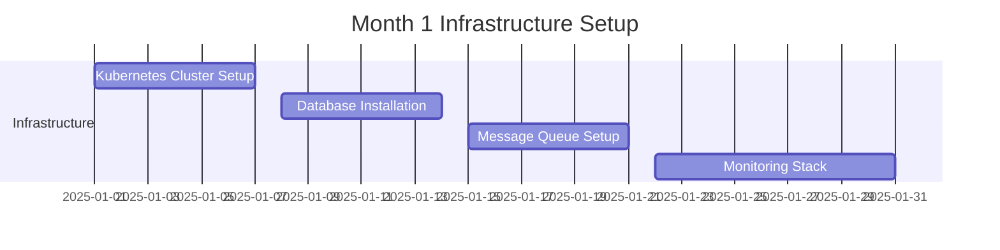

**Deliverables:**
- [ ] Kubernetes cluster with basic services
- [ ] TimescaleDB and PostgreSQL databases
- [ ] Apache Kafka message queue
- [ ] Prometheus & Grafana monitoring
- [ ] Basic CI/CD pipeline with Tekton

**Weeks 3-4: Core Services**
- [ ] Authentication service (Keycloak)
- [ ] API Gateway setup (Kong)
- [ ] Basic logging infrastructure (ELK)
- [ ] Security policies and RBAC

#### Month 2: Data Collection Framework

**Weeks 5-6: Git Data Collectors**
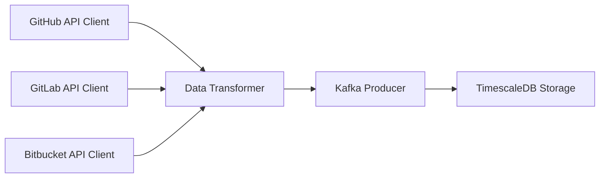

**Deliverables:**
- [ ] GitHub API collector service
- [ ] GitLab API collector service  
- [ ] Webhook handler for real-time events
- [ ] Data validation and transformation layer
- [ ] Basic commit and PR data ingestion

**Weeks 7-8: Project Management Integration**
- [ ] Jira API collector
- [ ] Azure DevOps API collector
- [ ] Issue and epic data collection
- [ ] Sprint and milestone tracking

#### Month 3: Basic Analytics Pipeline

**Weeks 9-10: Data Processing**
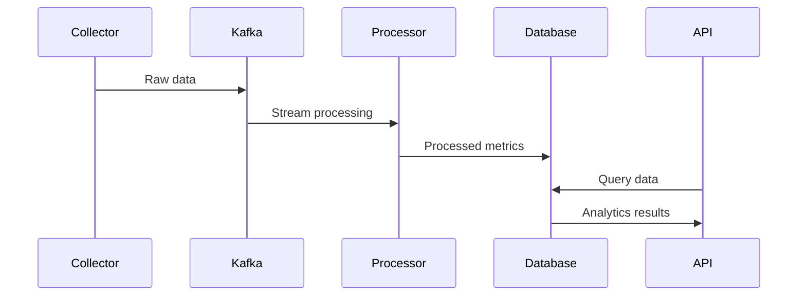

**Deliverables:**
- [ ] Apache Spark processing jobs
- [ ] Basic DORA metrics calculation
- [ ] Team velocity tracking
- [ ] Data quality monitoring

**Weeks 11-12: Frontend Foundation**
- [ ] React-based dashboard framework
- [ ] Basic authentication UI
- [ ] Simple metrics visualization
- [ ] Responsive design system

### Phase 1 Success Criteria
- [ ] 100+ developers' data being tracked
- [ ] 5+ repositories integrated
- [ ] Basic DORA metrics displayed
- [ ] 99%+ system uptime
- [ ] Sub-5 second dashboard load times

---

## Phase 2: Core Features (Months 4-6)

### Goals
- Implement comprehensive DORA metrics
- Build team performance analytics
- Add advanced data connectors
- Create real-time processing capabilities

#### Month 4: Advanced Metrics Engine

**Weeks 13-14: DORA Metrics Implementation**
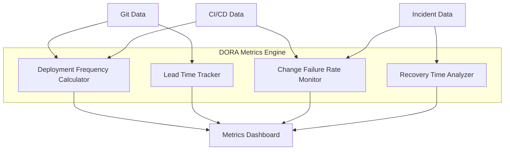

**Deliverables:**
- [ ] Deployment frequency calculation
- [ ] Lead time for changes tracking
- [ ] Change failure rate monitoring
- [ ] Mean time to recovery metrics
- [ ] Benchmarking against industry standards

**Weeks 15-16: Team Performance Analytics**
- [ ] Velocity trend analysis
- [ ] Burndown/burnup charts
- [ ] Cycle time breakdown
- [ ] Bottleneck identification
- [ ] Productivity scoring algorithms

#### Month 5: Advanced Integrations

**Weeks 17-18: CI/CD Pipeline Integration**
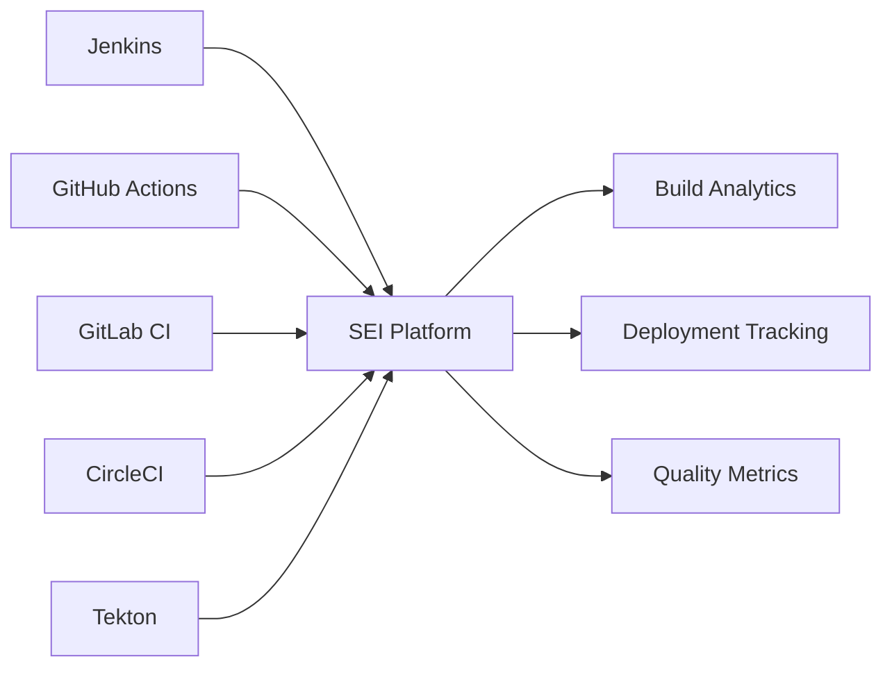

**Deliverables:**
- [ ] Jenkins integration
- [ ] GitHub Actions integration
- [ ] Build success/failure tracking
- [ ] Deployment pipeline visibility
- [ ] Test coverage analytics

**Weeks 19-20: Communication Tools**
- [ ] Slack integration
- [ ] Microsoft Teams integration
- [ ] Discord webhook support
- [ ] Communication pattern analysis
- [ ] Collaboration metrics

#### Month 6: Real-time Processing

**Weeks 21-22: Streaming Analytics**
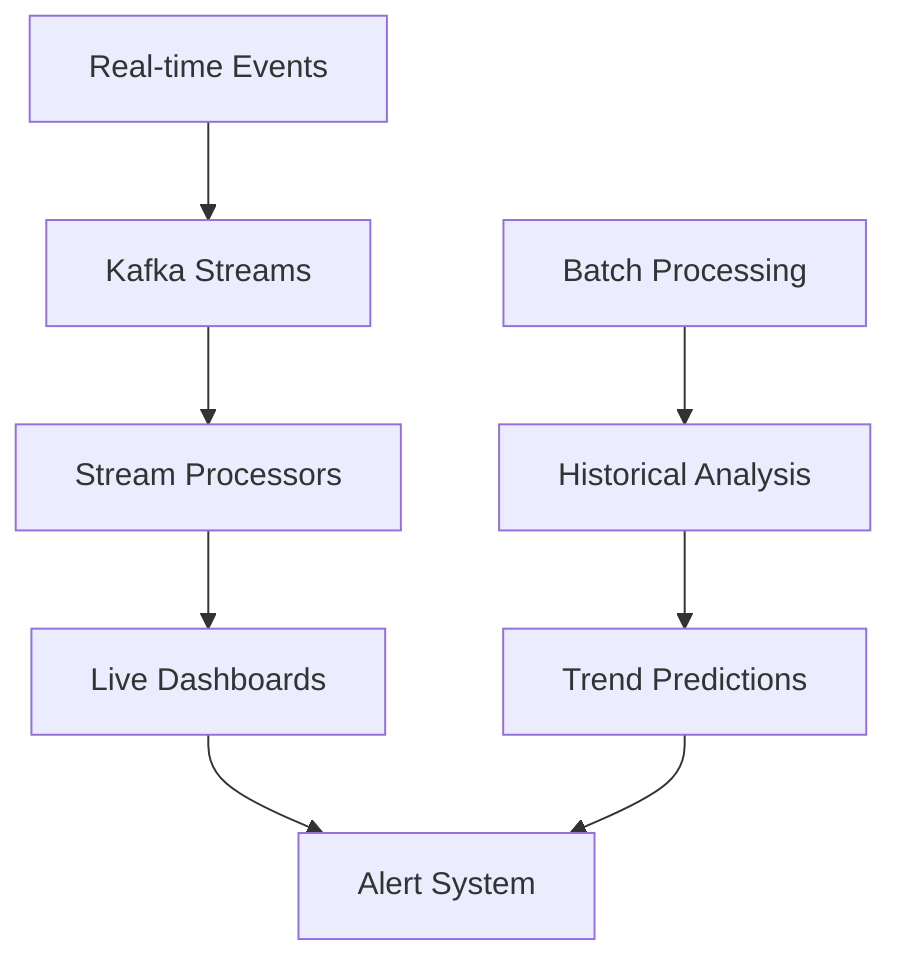

**Deliverables:**
- [ ] Real-time event processing
- [ ] Live dashboard updates
- [ ] Anomaly detection algorithms
- [ ] Automated alerting system
- [ ] Performance optimization

**Weeks 23-24: Advanced Dashboards**
- [ ] Executive-level KPI dashboards
- [ ] Team lead operational views
- [ ] Developer personal insights
- [ ] Customizable widget system
- [ ] Export and sharing capabilities

### Phase 2 Success Criteria
- [ ] All 4 DORA metrics implemented
- [ ] 10+ integrations working
- [ ] Real-time alerts functioning
- [ ] 500+ developers tracked
- [ ] Sub-2 second query response times

---

## Phase 3: Advanced Analytics (Months 7-9)

### Goals
- Implement machine learning models
- Add predictive analytics capabilities
- Create custom metrics framework
- Build mobile applications

#### Month 7: Machine Learning Pipeline

**Weeks 25-26: ML Infrastructure**
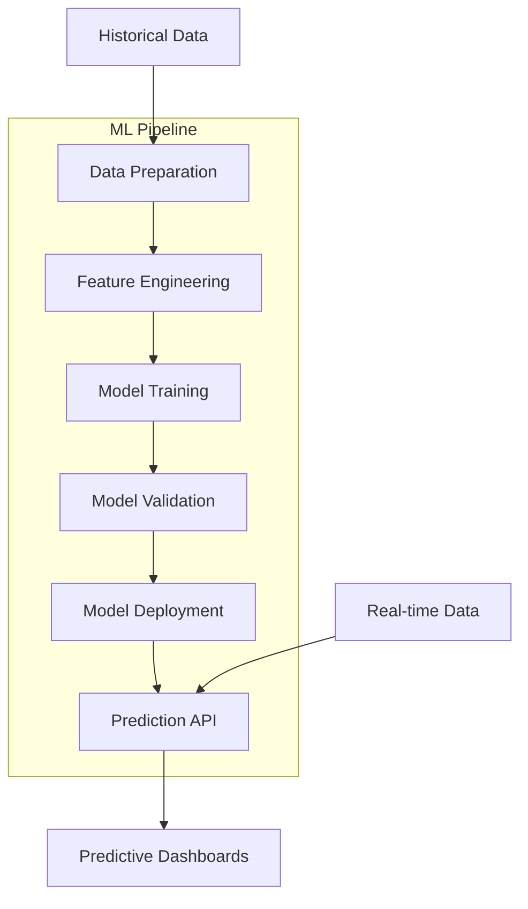

**Deliverables:**
- [ ] MLflow pipeline setup
- [ ] Feature engineering framework
- [ ] Model training automation
- [ ] A/B testing for models
- [ ] Model performance monitoring

**Weeks 27-28: Predictive Models**
- [ ] Delivery timeline prediction
- [ ] Risk assessment models
- [ ] Capacity planning algorithms
- [ ] Quality prediction models
- [ ] Burnout risk detection

#### Month 8: Custom Metrics Framework

**Weeks 29-30: Metrics Engine**
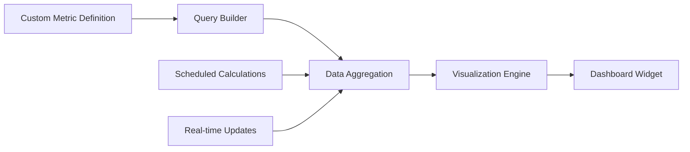

**Deliverables:**
- [ ] No-code metric builder
- [ ] Custom aggregation functions
- [ ] Scheduled metric calculations
- [ ] Metric validation system
- [ ] Performance optimization

**Weeks 31-32: Advanced Analytics**
- [ ] Correlation analysis
- [ ] Root cause analysis
- [ ] Impact assessment tools
- [ ] Trend forecasting
- [ ] Comparative benchmarking

#### Month 9: Mobile & API Platform

**Weeks 33-34: Mobile Application**
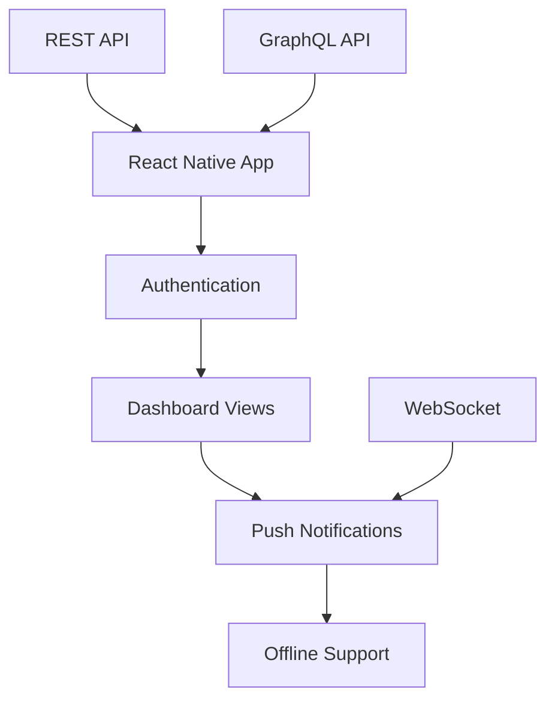

**Deliverables:**
- [ ] iOS and Android apps
- [ ] Push notification system
- [ ] Offline data synchronization
- [ ] Mobile-optimized dashboards
- [ ] Biometric authentication

**Weeks 35-36: API Platform**
- [ ] Public API documentation
- [ ] Rate limiting and quotas
- [ ] API key management
- [ ] Webhook subscriptions
- [ ] Third-party integrations

### Phase 3 Success Criteria
- [ ] 5+ ML models in production
- [ ] Custom metrics framework live
- [ ] Mobile apps in app stores
- [ ] 1000+ API requests/minute
- [ ] 95%+ prediction accuracy

---

## Phase 4: Enterprise Features (Months 10-12)

### Goals
- Implement multi-tenant architecture
- Add enterprise security features
- Optimize for scale
- Complete documentation and training

#### Month 10: Multi-tenant Architecture

**Weeks 37-38: Tenant Management**
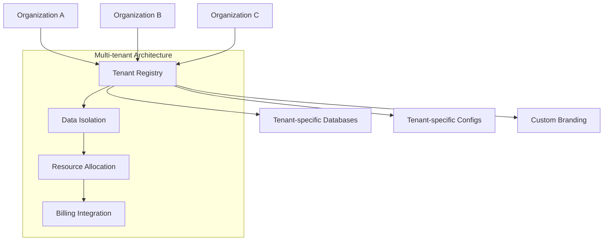

**Deliverables:**
- [ ] Tenant isolation framework
- [ ] Resource quota management
- [ ] Custom branding support
- [ ] Billing integration
- [ ] Tenant admin interfaces

**Weeks 39-40: Enterprise Security**
- [ ] SSO integration (SAML, OIDC)
- [ ] Advanced RBAC system
- [ ] Data encryption at rest
- [ ] Audit logging system
- [ ] Compliance reporting (SOC2, GDPR)

#### Month 11: Performance Optimization

**Weeks 41-42: Scalability Improvements**
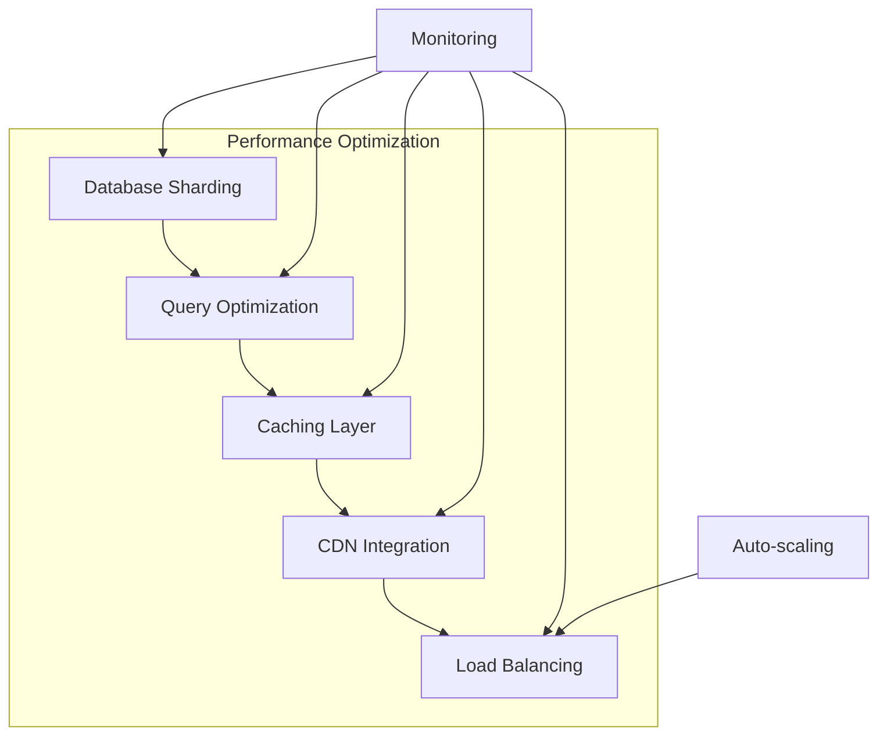

**Deliverables:**
- [ ] Database sharding implementation
- [ ] Query performance optimization
- [ ] Advanced caching strategies
- [ ] CDN for static assets
- [ ] Auto-scaling policies

**Weeks 43-44: High Availability**
- [ ] Multi-region deployment
- [ ] Disaster recovery procedures
- [ ] Backup and restore automation
- [ ] Circuit breaker patterns
- [ ] Chaos engineering tests

#### Month 12: Documentation & Training

**Weeks 45-46: Comprehensive Documentation**
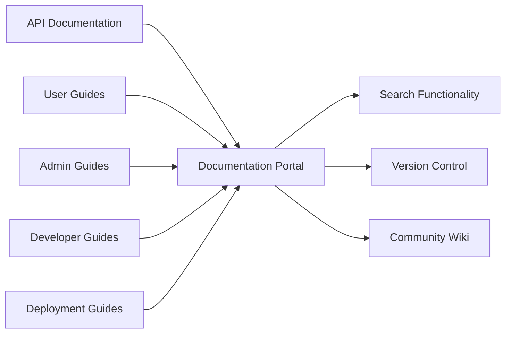

**Deliverables:**
- [ ] Complete API documentation
- [ ] User training materials
- [ ] Administrator guides
- [ ] Developer onboarding
- [ ] Video tutorials

**Weeks 47-48: Launch Preparation**
- [ ] Community building
- [ ] Open source licensing
- [ ] Contribution guidelines
- [ ] Issue templates
- [ ] Release automation

### Phase 4 Success Criteria
- [ ] Multi-tenant architecture deployed
- [ ] Enterprise security certified
- [ ] 10,000+ users supported
- [ ] Complete documentation available
- [ ] Active community established

---

## Resource Allocation

### Team Structure

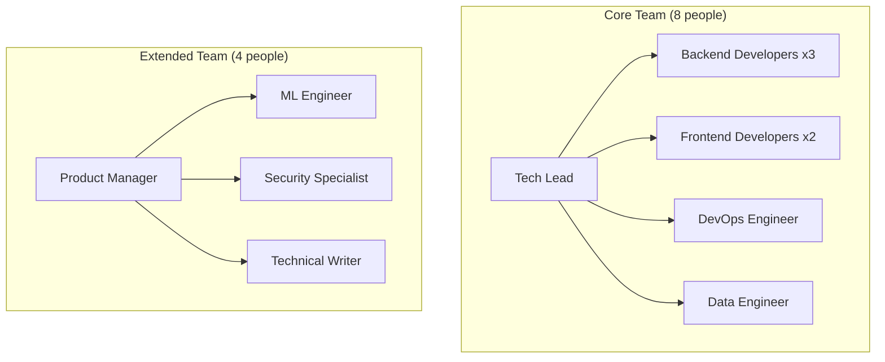

### Budget Breakdown

| Phase | Duration | Team Size | Cost |
|-------|----------|-----------|------|
| Phase 1 | 3 months | 6 people | $180K |
| Phase 2 | 3 months | 8 people | $240K |
| Phase 3 | 3 months | 10 people | $300K |
| Phase 4 | 3 months | 12 people | $360K |
| **Total** | **12 months** | **Average 9** | **$1.08M** |

### Infrastructure Costs

| Component | Monthly Cost | Annual Cost |
|-----------|--------------|-------------|
| Kubernetes Cluster | $2,000 | $24,000 |
| Databases | $1,500 | $18,000 |
| Monitoring | $500 | $6,000 |
| Storage | $800 | $9,600 |
| Network | $300 | $3,600 |
| **Total Infrastructure** | **$5,100** | **$61,200** |

---

## Risk Management

### Technical Risks

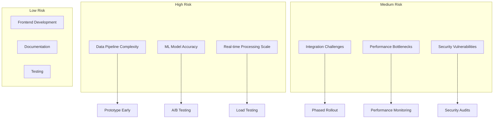

### Mitigation Strategies

| Risk | Probability | Impact | Mitigation |
|------|------------|---------|------------|
| **Data Integration Complexity** | High | High | Start with major platforms, build incrementally |
| **Scalability Issues** | Medium | High | Design for scale from day 1, load testing |
| **Resource Constraints** | Medium | Medium | Flexible team scaling, cross-training |
| **Technology Changes** | Low | Medium | Keep dependencies minimal, standard tech |

---

## Success Metrics

### Key Performance Indicators

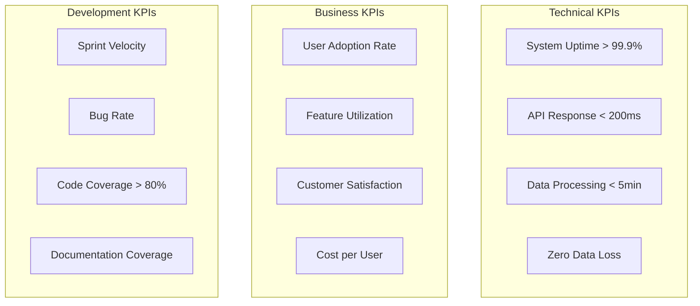

### Milestone Reviews

| Milestone | Review Date | Success Criteria | Go/No-Go Decision |
|-----------|-------------|------------------|-------------------|
| **Phase 1 Complete** | Month 3 | Basic platform functional | Continue to Phase 2 |
| **Phase 2 Complete** | Month 6 | Core metrics implemented | Continue to Phase 3 |
| **Phase 3 Complete** | Month 9 | Advanced features live | Continue to Phase 4 |
| **Project Complete** | Month 12 | Enterprise-ready platform | Production launch |

---

## Next Steps

1. **Week 1**: Assemble core team and finalize requirements
2. **Week 2**: Set up development environment and CI/CD
3. **Week 3**: Begin infrastructure deployment
4. **Week 4**: Start data collector development

**Ready to begin Phase 1 implementation!**